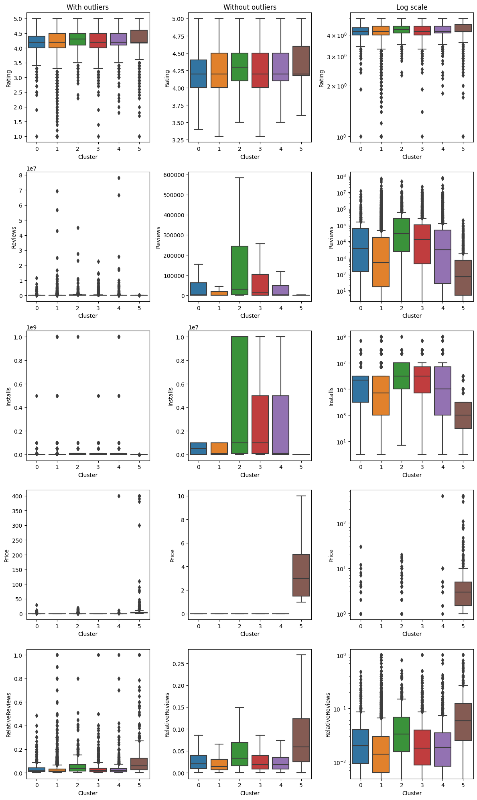
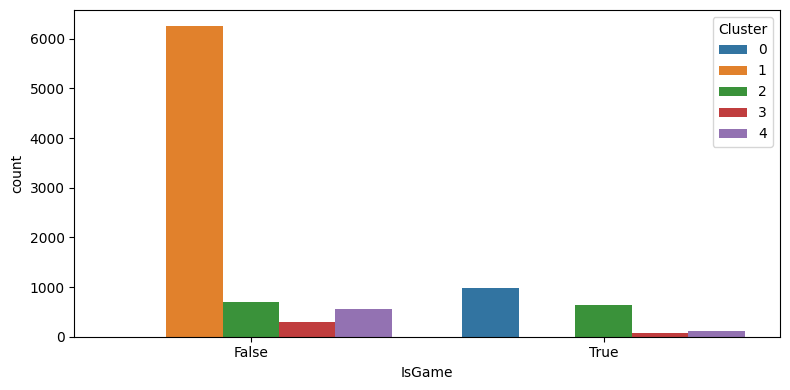

# Clustering - Google Play Store Apps

https://www.kaggle.com/datasets/lava18/google-play-store-apps

## Data dictionary

|Variable|Definition|
|:-------|:-------|
App|Application name
Category|Category the app belongs to
Rating|Overall user rating of the app
Reviews|Number of user reviews for the app
Size|Size of the app (MB)|
Installs|Number of user downloads/installs for the app
Type|Paid or Free
Price|Price of the app ($)
Content Rating|Age group the app is targeted at
Genres|The app's genres (including its category)


```python
import pandas as pd # dataframes
import numpy as np # matrices and linear algebra
import matplotlib.pyplot as plt # plotting
import seaborn as sns # another matplotlib interface - styled and easier to use

import matplotlib.ticker as ticker
import re

import sklearn
import sklearn.preprocessing, sklearn.cluster, sklearn.metrics, sklearn.decomposition, sklearn.manifold
import scipy.spatial
from scipy.cluster.hierarchy import dendrogram
```


```python
df = pd.read_csv('googleplaystore.csv', sep=',')
```

*Note: I corrected the category and genres for row 10472 in the dataset.*

## Basic analysis


```python
df
```


<div>
<style scoped>
    .dataframe tbody tr th:only-of-type {
        vertical-align: middle;
    }

    .dataframe tbody tr th {
        vertical-align: top;
    }

    .dataframe thead th {
        text-align: right;
    }
</style>
<table border="1" class="dataframe">
  <thead>
    <tr style="text-align: right;">
      <th></th>
      <th>App</th>
      <th>Category</th>
      <th>Rating</th>
      <th>Reviews</th>
      <th>Size</th>
      <th>Installs</th>
      <th>Type</th>
      <th>Price</th>
      <th>Content Rating</th>
      <th>Genres</th>
      <th>Last Updated</th>
      <th>Current Ver</th>
      <th>Android Ver</th>
    </tr>
  </thead>
  <tbody>
    <tr>
      <th>0</th>
      <td>Photo Editor &amp; Candy Camera &amp; Grid &amp; ScrapBook</td>
      <td>ART_AND_DESIGN</td>
      <td>4.1</td>
      <td>159</td>
      <td>19M</td>
      <td>10,000+</td>
      <td>Free</td>
      <td>0</td>
      <td>Everyone</td>
      <td>Art &amp; Design</td>
      <td>January 7, 2018</td>
      <td>1.0.0</td>
      <td>4.0.3 and up</td>
    </tr>
    <tr>
      <th>1</th>
      <td>Coloring book moana</td>
      <td>ART_AND_DESIGN</td>
      <td>3.9</td>
      <td>967</td>
      <td>14M</td>
      <td>500,000+</td>
      <td>Free</td>
      <td>0</td>
      <td>Everyone</td>
      <td>Art &amp; Design;Pretend Play</td>
      <td>January 15, 2018</td>
      <td>2.0.0</td>
      <td>4.0.3 and up</td>
    </tr>
    <tr>
      <th>2</th>
      <td>U Launcher Lite – FREE Live Cool Themes, Hide ...</td>
      <td>ART_AND_DESIGN</td>
      <td>4.7</td>
      <td>87510</td>
      <td>8.7M</td>
      <td>5,000,000+</td>
      <td>Free</td>
      <td>0</td>
      <td>Everyone</td>
      <td>Art &amp; Design</td>
      <td>August 1, 2018</td>
      <td>1.2.4</td>
      <td>4.0.3 and up</td>
    </tr>
    <tr>
      <th>3</th>
      <td>Sketch - Draw &amp; Paint</td>
      <td>ART_AND_DESIGN</td>
      <td>4.5</td>
      <td>215644</td>
      <td>25M</td>
      <td>50,000,000+</td>
      <td>Free</td>
      <td>0</td>
      <td>Teen</td>
      <td>Art &amp; Design</td>
      <td>June 8, 2018</td>
      <td>Varies with device</td>
      <td>4.2 and up</td>
    </tr>
    <tr>
      <th>4</th>
      <td>Pixel Draw - Number Art Coloring Book</td>
      <td>ART_AND_DESIGN</td>
      <td>4.3</td>
      <td>967</td>
      <td>2.8M</td>
      <td>100,000+</td>
      <td>Free</td>
      <td>0</td>
      <td>Everyone</td>
      <td>Art &amp; Design;Creativity</td>
      <td>June 20, 2018</td>
      <td>1.1</td>
      <td>4.4 and up</td>
    </tr>
    <tr>
      <th>...</th>
      <td>...</td>
      <td>...</td>
      <td>...</td>
      <td>...</td>
      <td>...</td>
      <td>...</td>
      <td>...</td>
      <td>...</td>
      <td>...</td>
      <td>...</td>
      <td>...</td>
      <td>...</td>
      <td>...</td>
    </tr>
    <tr>
      <th>10836</th>
      <td>Sya9a Maroc - FR</td>
      <td>FAMILY</td>
      <td>4.5</td>
      <td>38</td>
      <td>53M</td>
      <td>5,000+</td>
      <td>Free</td>
      <td>0</td>
      <td>Everyone</td>
      <td>Education</td>
      <td>July 25, 2017</td>
      <td>1.48</td>
      <td>4.1 and up</td>
    </tr>
    <tr>
      <th>10837</th>
      <td>Fr. Mike Schmitz Audio Teachings</td>
      <td>FAMILY</td>
      <td>5.0</td>
      <td>4</td>
      <td>3.6M</td>
      <td>100+</td>
      <td>Free</td>
      <td>0</td>
      <td>Everyone</td>
      <td>Education</td>
      <td>July 6, 2018</td>
      <td>1.0</td>
      <td>4.1 and up</td>
    </tr>
    <tr>
      <th>10838</th>
      <td>Parkinson Exercices FR</td>
      <td>MEDICAL</td>
      <td>NaN</td>
      <td>3</td>
      <td>9.5M</td>
      <td>1,000+</td>
      <td>Free</td>
      <td>0</td>
      <td>Everyone</td>
      <td>Medical</td>
      <td>January 20, 2017</td>
      <td>1.0</td>
      <td>2.2 and up</td>
    </tr>
    <tr>
      <th>10839</th>
      <td>The SCP Foundation DB fr nn5n</td>
      <td>BOOKS_AND_REFERENCE</td>
      <td>4.5</td>
      <td>114</td>
      <td>Varies with device</td>
      <td>1,000+</td>
      <td>Free</td>
      <td>0</td>
      <td>Mature 17+</td>
      <td>Books &amp; Reference</td>
      <td>January 19, 2015</td>
      <td>Varies with device</td>
      <td>Varies with device</td>
    </tr>
    <tr>
      <th>10840</th>
      <td>iHoroscope - 2018 Daily Horoscope &amp; Astrology</td>
      <td>LIFESTYLE</td>
      <td>4.5</td>
      <td>398307</td>
      <td>19M</td>
      <td>10,000,000+</td>
      <td>Free</td>
      <td>0</td>
      <td>Everyone</td>
      <td>Lifestyle</td>
      <td>July 25, 2018</td>
      <td>Varies with device</td>
      <td>Varies with device</td>
    </tr>
  </tbody>
</table>
<p>10841 rows × 13 columns</p>
</div>


```python
df = df.drop(['Last Updated', 'Current Ver', 'Android Ver'], axis=1)
```


```python
df.head(1)
```


<div>
<style scoped>
    .dataframe tbody tr th:only-of-type {
        vertical-align: middle;
    }

    .dataframe tbody tr th {
        vertical-align: top;
    }

    .dataframe thead th {
        text-align: right;
    }
</style>
<table border="1" class="dataframe">
  <thead>
    <tr style="text-align: right;">
      <th></th>
      <th>App</th>
      <th>Category</th>
      <th>Rating</th>
      <th>Reviews</th>
      <th>Size</th>
      <th>Installs</th>
      <th>Type</th>
      <th>Price</th>
      <th>Content Rating</th>
      <th>Genres</th>
    </tr>
  </thead>
  <tbody>
    <tr>
      <th>0</th>
      <td>Photo Editor &amp; Candy Camera &amp; Grid &amp; ScrapBook</td>
      <td>ART_AND_DESIGN</td>
      <td>4.1</td>
      <td>159</td>
      <td>19M</td>
      <td>10,000+</td>
      <td>Free</td>
      <td>0</td>
      <td>Everyone</td>
      <td>Art &amp; Design</td>
    </tr>
  </tbody>
</table>
</div>


```python
df.shape
```


    (10841, 10)


```python
df.isna().sum().sort_values(ascending=False)
```


    Rating            1474
    Type                 1
    App                  0
    Category             0
    Reviews              0
    Size                 0
    Installs             0
    Price                0
    Content Rating       0
    Genres               0
    dtype: int64


```python
df.dtypes
```


    App                object
    Category           object
    Rating            float64
    Reviews             int64
    Size               object
    Installs           object
    Type               object
    Price              object
    Content Rating     object
    Genres             object
    dtype: object


```python
# df.describe(exclude=np.number)
print(f'Column: Unique values')
for col in df.select_dtypes(exclude=np.number):
    print(f'{col}: {df[col].unique().shape[0]}')
```

    Column: Unique values
    App: 9660
    Category: 33
    Size: 461
    Installs: 21
    Type: 3
    Price: 92
    Content Rating: 6
    Genres: 119
    

### Remove duplicate apps


```python
df_count = df.groupby('App').App.count().reset_index(name='Count')
df_count.loc[df_count.Count > 1, :]
```


<div>
<style scoped>
    .dataframe tbody tr th:only-of-type {
        vertical-align: middle;
    }

    .dataframe tbody tr th {
        vertical-align: top;
    }

    .dataframe thead th {
        text-align: right;
    }
</style>
<table border="1" class="dataframe">
  <thead>
    <tr style="text-align: right;">
      <th></th>
      <th>App</th>
      <th>Count</th>
    </tr>
  </thead>
  <tbody>
    <tr>
      <th>7</th>
      <td>10 Best Foods for You</td>
      <td>2</td>
    </tr>
    <tr>
      <th>20</th>
      <td>1800 Contacts - Lens Store</td>
      <td>2</td>
    </tr>
    <tr>
      <th>29</th>
      <td>2017 EMRA Antibiotic Guide</td>
      <td>2</td>
    </tr>
    <tr>
      <th>35</th>
      <td>21-Day Meditation Experience</td>
      <td>2</td>
    </tr>
    <tr>
      <th>57</th>
      <td>365Scores - Live Scores</td>
      <td>2</td>
    </tr>
    <tr>
      <th>...</th>
      <td>...</td>
      <td>...</td>
    </tr>
    <tr>
      <th>9585</th>
      <td>stranger chat - anonymous chat</td>
      <td>2</td>
    </tr>
    <tr>
      <th>9592</th>
      <td>textPlus: Free Text &amp; Calls</td>
      <td>2</td>
    </tr>
    <tr>
      <th>9597</th>
      <td>theScore: Live Sports Scores, News, Stats &amp; Vi...</td>
      <td>5</td>
    </tr>
    <tr>
      <th>9602</th>
      <td>trivago: Hotels &amp; Travel</td>
      <td>3</td>
    </tr>
    <tr>
      <th>9620</th>
      <td>wetter.com - Weather and Radar</td>
      <td>2</td>
    </tr>
  </tbody>
</table>
<p>798 rows × 2 columns</p>
</div>


```python
df.loc[df.App == '365Scores - Live Scores', :]
```


<div>
<style scoped>
    .dataframe tbody tr th:only-of-type {
        vertical-align: middle;
    }

    .dataframe tbody tr th {
        vertical-align: top;
    }

    .dataframe thead th {
        text-align: right;
    }
</style>
<table border="1" class="dataframe">
  <thead>
    <tr style="text-align: right;">
      <th></th>
      <th>App</th>
      <th>Category</th>
      <th>Rating</th>
      <th>Reviews</th>
      <th>Size</th>
      <th>Installs</th>
      <th>Type</th>
      <th>Price</th>
      <th>Content Rating</th>
      <th>Genres</th>
    </tr>
  </thead>
  <tbody>
    <tr>
      <th>3083</th>
      <td>365Scores - Live Scores</td>
      <td>SPORTS</td>
      <td>4.6</td>
      <td>666521</td>
      <td>25M</td>
      <td>10,000,000+</td>
      <td>Free</td>
      <td>0</td>
      <td>Everyone</td>
      <td>Sports</td>
    </tr>
    <tr>
      <th>5415</th>
      <td>365Scores - Live Scores</td>
      <td>SPORTS</td>
      <td>4.6</td>
      <td>666246</td>
      <td>25M</td>
      <td>10,000,000+</td>
      <td>Free</td>
      <td>0</td>
      <td>Everyone</td>
      <td>Sports</td>
    </tr>
  </tbody>
</table>
</div>


```python
df = df.drop_duplicates(subset=['App'])
```


```python
df_count = df.groupby('App').App.count().reset_index(name='Count')
df_count.loc[df_count.Count > 1, :]
```


<div>
<style scoped>
    .dataframe tbody tr th:only-of-type {
        vertical-align: middle;
    }

    .dataframe tbody tr th {
        vertical-align: top;
    }

    .dataframe thead th {
        text-align: right;
    }
</style>
<table border="1" class="dataframe">
  <thead>
    <tr style="text-align: right;">
      <th></th>
      <th>App</th>
      <th>Count</th>
    </tr>
  </thead>
  <tbody>
  </tbody>
</table>
</div>


### Convert Installs into numbers


```python
df.Installs.unique()
```


    array(['10,000+', '500,000+', '5,000,000+', '50,000,000+', '100,000+',
           '50,000+', '1,000,000+', '10,000,000+', '5,000+', '100,000,000+',
           '1,000,000,000+', '1,000+', '500,000,000+', '50+', '100+', '500+',
           '10+', '1+', '5+', '0+', '0'], dtype=object)


```python
df.Installs.apply(lambda x: int(x.replace(',', '').replace('+', ''))).unique()
```


    array([     10000,     500000,    5000000,   50000000,     100000,
                50000,    1000000,   10000000,       5000,  100000000,
           1000000000,       1000,  500000000,         50,        100,
                  500,         10,          1,          5,          0],
          dtype=int64)


```python
df.Installs = df.Installs.apply(lambda x: int(x.replace(',', '').replace('+', '')))
```


```python
df = df.sort_values(by=['Installs'], ascending=False)
```

### Convert Size into numbers


```python
df.Size.apply(lambda x: x[-1]).unique()
```


    array(['e', 'M', 'k'], dtype=object)


```python
df.loc[df.Size.apply(lambda x: x[-1]) == 'e', 'Size']
```


    336     Varies with device
    152     Varies with device
    3117    Varies with device
    340     Varies with device
    2545    Varies with device
                   ...        
    9417    Varies with device
    4218    Varies with device
    6277    Varies with device
    6479    Varies with device
    9148    Varies with device
    Name: Size, Length: 1227, dtype: object


```python
def convert_size(x):
    if x == 'Varies with device':
        return float("NaN")
    
    unit = x[-1]
    value = float(x[:-1])
    if unit == 'k':
        return value / 1000 # 1024?
    return value
```


```python
df.Size = df.Size.apply(convert_size)
```

### Convert Price into numbers


```python
df.Price.unique()
```


    array(['0', '$6.99', '$0.99', '$2.99', '$4.99', '$1.99', '$5.99', '$2.49',
           '$3.99', '$13.99', '$14.99', '$9.99', '$24.99', '$8.99', '$9.00',
           '$11.99', '$3.49', '$1.49', '$2.90', '$7.99', '$3.95', '$4.49',
           '$399.99', '$29.99', '$19.99', '$4.77', '$3.90', '$12.99', '$2.95',
           '$16.99', '$1.97', '$1.20', '$3.28', '$17.99', '$2.59', '$1.59',
           '$2.50', '$10.00', '$299.99', '$18.99', '$389.99', '$5.49',
           '$400.00', '$4.60', '$1.00', '$79.99', '$7.49', '$37.99',
           '$379.99', '$8.49', '$4.29', '$74.99', '$2.56', '$1.70', '$4.84',
           '$1.61', '$1.29', '$33.99', '$10.99', '$1.50', '$3.08', '$15.46',
           '$19.40', '$15.99', '$2.00', '$3.88', '$4.59', '$39.99', '$1.26',
           '$6.49', '$5.00', '$19.90', '$14.00', '$3.02', '$1.76', '$1.04',
           '$2.60', '$4.85', '$1.75', '$3.04', '$46.99', '$25.99', '$3.61',
           '$89.99', '$1.96', '$4.80', '$28.99', '$109.99', '$154.99',
           '$30.99', '$200.00', '$394.99'], dtype=object)


```python
df.Price.apply(lambda x: x[0]).unique()
```


    array(['0', '$'], dtype=object)


```python
df.Price = df.Price.apply(lambda x: 0 if x == '0' else float(x[1:]))
```

### Simplify Content Rating


```python
df['Content Rating'].value_counts()
```


    Everyone           7904
    Teen               1036
    Mature 17+          393
    Everyone 10+        322
    Adults only 18+       3
    Unrated               2
    Name: Content Rating, dtype: int64


```python
df.loc[df['Content Rating'] == 'Everyone 10+'].head(3)
```


<div>
<style scoped>
    .dataframe tbody tr th:only-of-type {
        vertical-align: middle;
    }

    .dataframe tbody tr th {
        vertical-align: top;
    }

    .dataframe thead th {
        text-align: right;
    }
</style>
<table border="1" class="dataframe">
  <thead>
    <tr style="text-align: right;">
      <th></th>
      <th>App</th>
      <th>Category</th>
      <th>Rating</th>
      <th>Reviews</th>
      <th>Size</th>
      <th>Installs</th>
      <th>Type</th>
      <th>Price</th>
      <th>Content Rating</th>
      <th>Genres</th>
    </tr>
  </thead>
  <tbody>
    <tr>
      <th>1654</th>
      <td>Subway Surfers</td>
      <td>GAME</td>
      <td>4.5</td>
      <td>27722264</td>
      <td>76.0</td>
      <td>1000000000</td>
      <td>Free</td>
      <td>0.0</td>
      <td>Everyone 10+</td>
      <td>Arcade</td>
    </tr>
    <tr>
      <th>3755</th>
      <td>Flipboard: News For Our Time</td>
      <td>NEWS_AND_MAGAZINES</td>
      <td>4.4</td>
      <td>1284017</td>
      <td>NaN</td>
      <td>500000000</td>
      <td>Free</td>
      <td>0.0</td>
      <td>Everyone 10+</td>
      <td>News &amp; Magazines</td>
    </tr>
    <tr>
      <th>4111</th>
      <td>Talking Tom Cat 2</td>
      <td>FAMILY</td>
      <td>4.3</td>
      <td>3213548</td>
      <td>55.0</td>
      <td>100000000</td>
      <td>Free</td>
      <td>0.0</td>
      <td>Everyone 10+</td>
      <td>Entertainment</td>
    </tr>
  </tbody>
</table>
</div>


```python
df.loc[df['Content Rating'] == 'Unrated', 'Content Rating'] = 'Everyone'
df.loc[df['Content Rating'] == 'Everyone 10+', 'Content Rating'] = 'Teen'
df.loc[df['Content Rating'] == 'Adults only 18+', 'Content Rating'] = 'Mature'
df.loc[df['Content Rating'] == 'Mature 17+', 'Content Rating'] = 'Mature'
df['Content Rating'].value_counts()
```


    Everyone    7906
    Teen        1358
    Mature       396
    Name: Content Rating, dtype: int64


```python
sns.countplot(x=df['Content Rating'])
```


    <AxesSubplot: xlabel='Content Rating', ylabel='count'>


    

    


```python
df
```


<div>
<style scoped>
    .dataframe tbody tr th:only-of-type {
        vertical-align: middle;
    }

    .dataframe tbody tr th {
        vertical-align: top;
    }

    .dataframe thead th {
        text-align: right;
    }
</style>
<table border="1" class="dataframe">
  <thead>
    <tr style="text-align: right;">
      <th></th>
      <th>App</th>
      <th>Category</th>
      <th>Rating</th>
      <th>Reviews</th>
      <th>Size</th>
      <th>Installs</th>
      <th>Type</th>
      <th>Price</th>
      <th>Content Rating</th>
      <th>Genres</th>
    </tr>
  </thead>
  <tbody>
    <tr>
      <th>336</th>
      <td>WhatsApp Messenger</td>
      <td>COMMUNICATION</td>
      <td>4.4</td>
      <td>69119316</td>
      <td>NaN</td>
      <td>1000000000</td>
      <td>Free</td>
      <td>0.00</td>
      <td>Everyone</td>
      <td>Communication</td>
    </tr>
    <tr>
      <th>152</th>
      <td>Google Play Books</td>
      <td>BOOKS_AND_REFERENCE</td>
      <td>3.9</td>
      <td>1433233</td>
      <td>NaN</td>
      <td>1000000000</td>
      <td>Free</td>
      <td>0.00</td>
      <td>Teen</td>
      <td>Books &amp; Reference</td>
    </tr>
    <tr>
      <th>1654</th>
      <td>Subway Surfers</td>
      <td>GAME</td>
      <td>4.5</td>
      <td>27722264</td>
      <td>76.0</td>
      <td>1000000000</td>
      <td>Free</td>
      <td>0.00</td>
      <td>Teen</td>
      <td>Arcade</td>
    </tr>
    <tr>
      <th>3117</th>
      <td>Maps - Navigate &amp; Explore</td>
      <td>TRAVEL_AND_LOCAL</td>
      <td>4.3</td>
      <td>9235155</td>
      <td>NaN</td>
      <td>1000000000</td>
      <td>Free</td>
      <td>0.00</td>
      <td>Everyone</td>
      <td>Travel &amp; Local</td>
    </tr>
    <tr>
      <th>340</th>
      <td>Gmail</td>
      <td>COMMUNICATION</td>
      <td>4.3</td>
      <td>4604324</td>
      <td>NaN</td>
      <td>1000000000</td>
      <td>Free</td>
      <td>0.00</td>
      <td>Everyone</td>
      <td>Communication</td>
    </tr>
    <tr>
      <th>...</th>
      <td>...</td>
      <td>...</td>
      <td>...</td>
      <td>...</td>
      <td>...</td>
      <td>...</td>
      <td>...</td>
      <td>...</td>
      <td>...</td>
      <td>...</td>
    </tr>
    <tr>
      <th>9719</th>
      <td>EP Cook Book</td>
      <td>MEDICAL</td>
      <td>NaN</td>
      <td>0</td>
      <td>3.2</td>
      <td>0</td>
      <td>Paid</td>
      <td>200.00</td>
      <td>Everyone</td>
      <td>Medical</td>
    </tr>
    <tr>
      <th>9917</th>
      <td>Eu Sou Rico</td>
      <td>FINANCE</td>
      <td>NaN</td>
      <td>0</td>
      <td>1.4</td>
      <td>0</td>
      <td>Paid</td>
      <td>394.99</td>
      <td>Everyone</td>
      <td>Finance</td>
    </tr>
    <tr>
      <th>7434</th>
      <td>Pekalongan CJ</td>
      <td>SOCIAL</td>
      <td>NaN</td>
      <td>0</td>
      <td>5.9</td>
      <td>0</td>
      <td>Free</td>
      <td>0.00</td>
      <td>Teen</td>
      <td>Social</td>
    </tr>
    <tr>
      <th>9337</th>
      <td>EG | Explore Folegandros</td>
      <td>TRAVEL_AND_LOCAL</td>
      <td>NaN</td>
      <td>0</td>
      <td>56.0</td>
      <td>0</td>
      <td>Paid</td>
      <td>3.99</td>
      <td>Everyone</td>
      <td>Travel &amp; Local</td>
    </tr>
    <tr>
      <th>5486</th>
      <td>AP Series Solution Pro</td>
      <td>FAMILY</td>
      <td>NaN</td>
      <td>0</td>
      <td>7.4</td>
      <td>0</td>
      <td>Paid</td>
      <td>1.99</td>
      <td>Everyone</td>
      <td>Education</td>
    </tr>
  </tbody>
</table>
<p>9660 rows × 10 columns</p>
</div>


### Numeric columns


```python
df.describe()
```


<div>
<style scoped>
    .dataframe tbody tr th:only-of-type {
        vertical-align: middle;
    }

    .dataframe tbody tr th {
        vertical-align: top;
    }

    .dataframe thead th {
        text-align: right;
    }
</style>
<table border="1" class="dataframe">
  <thead>
    <tr style="text-align: right;">
      <th></th>
      <th>Rating</th>
      <th>Reviews</th>
      <th>Size</th>
      <th>Installs</th>
      <th>Price</th>
    </tr>
  </thead>
  <tbody>
    <tr>
      <th>count</th>
      <td>8197.000000</td>
      <td>9.660000e+03</td>
      <td>8433.000000</td>
      <td>9.660000e+03</td>
      <td>9660.000000</td>
    </tr>
    <tr>
      <th>mean</th>
      <td>4.172966</td>
      <td>2.165701e+05</td>
      <td>20.393227</td>
      <td>7.776702e+06</td>
      <td>1.099185</td>
    </tr>
    <tr>
      <th>std</th>
      <td>0.537179</td>
      <td>1.831226e+06</td>
      <td>21.827070</td>
      <td>5.375555e+07</td>
      <td>16.851283</td>
    </tr>
    <tr>
      <th>min</th>
      <td>1.000000</td>
      <td>0.000000e+00</td>
      <td>0.008500</td>
      <td>0.000000e+00</td>
      <td>0.000000</td>
    </tr>
    <tr>
      <th>25%</th>
      <td>4.000000</td>
      <td>2.500000e+01</td>
      <td>4.600000</td>
      <td>1.000000e+03</td>
      <td>0.000000</td>
    </tr>
    <tr>
      <th>50%</th>
      <td>4.300000</td>
      <td>9.670000e+02</td>
      <td>12.000000</td>
      <td>1.000000e+05</td>
      <td>0.000000</td>
    </tr>
    <tr>
      <th>75%</th>
      <td>4.500000</td>
      <td>2.939400e+04</td>
      <td>28.000000</td>
      <td>1.000000e+06</td>
      <td>0.000000</td>
    </tr>
    <tr>
      <th>max</th>
      <td>5.000000</td>
      <td>7.815831e+07</td>
      <td>100.000000</td>
      <td>1.000000e+09</td>
      <td>400.000000</td>
    </tr>
  </tbody>
</table>
</div>


```python
cols = df.select_dtypes(include=np.number).columns
fig, ax = plt.subplots(len(cols), 2, figsize=(12, len(cols) * 4))
ax = ax.flatten()
for i, col in enumerate(cols):
  sns.boxplot(data=df, y=col, ax=ax[i * 2])
  sns.boxplot(data=df, y=col, ax=ax[i * 2 + 1], showfliers=False)
  if i == 0:
      ax[i * 2].set_title('With outliers')
      ax[i * 2 + 1].set_title('Without outliers')
plt.show()

```


    

    


```python
plt.figure(figsize=(12, 9))
sns.heatmap(df.corr(), square=True, cmap='RdYlGn', vmin=-1, vmax=1, annot=True)
```

    C:\Users\28D\AppData\Local\Temp\ipykernel_15328\2383890127.py:2: FutureWarning: The default value of numeric_only in DataFrame.corr is deprecated. In a future version, it will default to False. Select only valid columns or specify the value of numeric_only to silence this warning.
      sns.heatmap(df.corr(), square=True, cmap='RdYlGn', vmin=-1, vmax=1, annot=True)
    


    <AxesSubplot: >


    

    


### Type


```python
df.Type.value_counts()
```


    Free    8903
    Paid     756
    Name: Type, dtype: int64


```python
sns.countplot(x=df.Type)
```


    <AxesSubplot: xlabel='Type', ylabel='count'>


    

    


### Category


```python
df.Category.value_counts()
```


    FAMILY                 1832
    GAME                    959
    TOOLS                   827
    BUSINESS                420
    MEDICAL                 395
    PERSONALIZATION         376
    PRODUCTIVITY            374
    LIFESTYLE               370
    FINANCE                 345
    SPORTS                  325
    COMMUNICATION           315
    HEALTH_AND_FITNESS      288
    PHOTOGRAPHY             281
    NEWS_AND_MAGAZINES      254
    SOCIAL                  239
    BOOKS_AND_REFERENCE     222
    TRAVEL_AND_LOCAL        219
    SHOPPING                202
    DATING                  171
    VIDEO_PLAYERS           163
    MAPS_AND_NAVIGATION     131
    EDUCATION               119
    FOOD_AND_DRINK          112
    ENTERTAINMENT           102
    AUTO_AND_VEHICLES        85
    LIBRARIES_AND_DEMO       84
    WEATHER                  79
    HOUSE_AND_HOME           74
    ART_AND_DESIGN           64
    EVENTS                   64
    PARENTING                60
    COMICS                   56
    BEAUTY                   53
    Name: Category, dtype: int64


```python
df.loc[df.Category == 'FAMILY', 'Content Rating'].value_counts()
```


    Everyone    1432
    Teen         350
    Mature        50
    Name: Content Rating, dtype: int64


```python
df.loc[(df.Category == 'FAMILY') & (df['Content Rating'] == 'Mature'), :].head(5)
```


<div>
<style scoped>
    .dataframe tbody tr th:only-of-type {
        vertical-align: middle;
    }

    .dataframe tbody tr th {
        vertical-align: top;
    }

    .dataframe thead th {
        text-align: right;
    }
</style>
<table border="1" class="dataframe">
  <thead>
    <tr style="text-align: right;">
      <th></th>
      <th>App</th>
      <th>Category</th>
      <th>Rating</th>
      <th>Reviews</th>
      <th>Size</th>
      <th>Installs</th>
      <th>Type</th>
      <th>Price</th>
      <th>Content Rating</th>
      <th>Genres</th>
    </tr>
  </thead>
  <tbody>
    <tr>
      <th>5049</th>
      <td>iFunny :)</td>
      <td>FAMILY</td>
      <td>4.4</td>
      <td>503757</td>
      <td>NaN</td>
      <td>10000000</td>
      <td>Free</td>
      <td>0.0</td>
      <td>Mature</td>
      <td>Entertainment</td>
    </tr>
    <tr>
      <th>8443</th>
      <td>Meme Generator Free</td>
      <td>FAMILY</td>
      <td>4.4</td>
      <td>303394</td>
      <td>53.0</td>
      <td>10000000</td>
      <td>Free</td>
      <td>0.0</td>
      <td>Mature</td>
      <td>Entertainment</td>
    </tr>
    <tr>
      <th>5865</th>
      <td>Gangster Town: Vice District</td>
      <td>FAMILY</td>
      <td>4.3</td>
      <td>65146</td>
      <td>100.0</td>
      <td>10000000</td>
      <td>Free</td>
      <td>0.0</td>
      <td>Mature</td>
      <td>Simulation</td>
    </tr>
    <tr>
      <th>5425</th>
      <td>Virtual Cigarette Smoking (prank)</td>
      <td>FAMILY</td>
      <td>3.7</td>
      <td>29838</td>
      <td>NaN</td>
      <td>5000000</td>
      <td>Free</td>
      <td>0.0</td>
      <td>Mature</td>
      <td>Entertainment</td>
    </tr>
    <tr>
      <th>5422</th>
      <td>High School Simulator 2017</td>
      <td>FAMILY</td>
      <td>4.2</td>
      <td>123136</td>
      <td>80.0</td>
      <td>5000000</td>
      <td>Free</td>
      <td>0.0</td>
      <td>Mature</td>
      <td>Simulation</td>
    </tr>
  </tbody>
</table>
</div>


#### The Family category is the most popular. From what I've found it should be a general category for apps and games for kids, but there are apparently even Mature apps. It seems kind of useless, so I will replace it with the first Genre of each app.


```python
df.loc[df.Category == 'FAMILY'].Genres.value_counts().head(10)
```


    Entertainment            469
    Education                411
    Simulation               183
    Casual                   142
    Puzzle                    95
    Role Playing              90
    Strategy                  78
    Educational;Education     38
    Educational               37
    Education;Education       28
    Name: Genres, dtype: int64


```python
df.loc[df.Category == 'FAMILY'].Genres.str.extract(r'([^;]+);?').value_counts().head(20)
```


    Entertainment              490
    Education                  461
    Casual                     198
    Simulation                 194
    Puzzle                     118
    Educational                102
    Role Playing               100
    Strategy                    82
    Board                       19
    Racing                      17
    Arcade                      15
    Action                       9
    Adventure                    6
    Sports                       4
    Books & Reference            3
    Music                        3
    Health & Fitness             2
    Card                         2
    Video Players & Editors      2
    Music & Audio                1
    dtype: int64


Concrete genres of games will have to be assigned to the GAME category. 


```python
def genre_to_category(x):
    return re.search(r'([^;]+);?', x).group(1).replace(' ', '_').replace('&', 'AND').upper()
```


```python
cats = df.loc[df.Category == 'FAMILY'].Genres.str.extract(r'([^;]+);?', expand=False).apply(genre_to_category)
cats.loc[~cats.isin(df.Category.unique())].value_counts()
```


    CASUAL                       198
    SIMULATION                   194
    PUZZLE                       118
    EDUCATIONAL                  102
    ROLE_PLAYING                 100
    STRATEGY                      82
    BOARD                         19
    RACING                        17
    ARCADE                        15
    ACTION                         9
    ADVENTURE                      6
    MUSIC                          3
    CARD                           2
    VIDEO_PLAYERS_AND_EDITORS      2
    MUSIC_AND_AUDIO                1
    TRIVIA                         1
    Name: Genres, dtype: int64


```python
df.loc[(df.Category == 'FAMILY') & (df.Genres.str.match(r'^Music', na=False))]
```


<div>
<style scoped>
    .dataframe tbody tr th:only-of-type {
        vertical-align: middle;
    }

    .dataframe tbody tr th {
        vertical-align: top;
    }

    .dataframe thead th {
        text-align: right;
    }
</style>
<table border="1" class="dataframe">
  <thead>
    <tr style="text-align: right;">
      <th></th>
      <th>App</th>
      <th>Category</th>
      <th>Rating</th>
      <th>Reviews</th>
      <th>Size</th>
      <th>Installs</th>
      <th>Type</th>
      <th>Price</th>
      <th>Content Rating</th>
      <th>Genres</th>
    </tr>
  </thead>
  <tbody>
    <tr>
      <th>2051</th>
      <td>Piano Kids - Music &amp; Songs</td>
      <td>FAMILY</td>
      <td>4.6</td>
      <td>46741</td>
      <td>50.0</td>
      <td>10000000</td>
      <td>Free</td>
      <td>0.00</td>
      <td>Everyone</td>
      <td>Music;Music &amp; Video</td>
    </tr>
    <tr>
      <th>2142</th>
      <td>Toy Guitar with songs for kids</td>
      <td>FAMILY</td>
      <td>4.3</td>
      <td>1369</td>
      <td>9.8</td>
      <td>500000</td>
      <td>Free</td>
      <td>0.00</td>
      <td>Everyone</td>
      <td>Music &amp; Audio;Music &amp; Video</td>
    </tr>
    <tr>
      <th>2060</th>
      <td>Rhythm Patrol</td>
      <td>FAMILY</td>
      <td>4.3</td>
      <td>4207</td>
      <td>26.0</td>
      <td>100000</td>
      <td>Free</td>
      <td>0.00</td>
      <td>Everyone</td>
      <td>Music;Music &amp; Video</td>
    </tr>
    <tr>
      <th>9470</th>
      <td>Learn Music Notes</td>
      <td>FAMILY</td>
      <td>4.7</td>
      <td>143</td>
      <td>4.4</td>
      <td>1000</td>
      <td>Paid</td>
      <td>1.99</td>
      <td>Everyone</td>
      <td>Music;Music &amp; Video</td>
    </tr>
  </tbody>
</table>
</div>


```python
unique_cats = df.Category.unique()
def genre_to_category(x):
    cat = re.search(r'([^;]+)', x).group(1).replace(' ', '_').replace('&', 'AND').upper()
    if cat == 'VIDEO_PLAYERS_AND_EDITORS':
        return 'VIDEO_PLAYERS'
    elif cat not in unique_cats:
        return 'GAME'
    return cat
```


```python
df.apply(lambda x: x.Category if x.Category != 'FAMILY' else genre_to_category(x.Genres), axis=1)
```


    336           COMMUNICATION
    152     BOOKS_AND_REFERENCE
    1654                   GAME
    3117       TRAVEL_AND_LOCAL
    340           COMMUNICATION
                   ...         
    9719                MEDICAL
    9917                FINANCE
    7434                 SOCIAL
    9337       TRAVEL_AND_LOCAL
    5486              EDUCATION
    Length: 9660, dtype: object


```python
df.Category = df.apply(lambda x: x.Category if x.Category != 'FAMILY' else genre_to_category(x.Genres), axis=1)
df.Category.value_counts()
```


    GAME                   1826
    TOOLS                   827
    ENTERTAINMENT           592
    EDUCATION               580
    BUSINESS                420
    MEDICAL                 395
    PERSONALIZATION         376
    PRODUCTIVITY            374
    LIFESTYLE               371
    FINANCE                 345
    SPORTS                  329
    COMMUNICATION           316
    HEALTH_AND_FITNESS      290
    PHOTOGRAPHY             281
    NEWS_AND_MAGAZINES      254
    SOCIAL                  239
    BOOKS_AND_REFERENCE     225
    TRAVEL_AND_LOCAL        219
    SHOPPING                202
    DATING                  171
    VIDEO_PLAYERS           165
    MAPS_AND_NAVIGATION     131
    FOOD_AND_DRINK          112
    AUTO_AND_VEHICLES        85
    LIBRARIES_AND_DEMO       84
    WEATHER                  79
    HOUSE_AND_HOME           74
    ART_AND_DESIGN           65
    EVENTS                   64
    PARENTING                60
    COMICS                   56
    BEAUTY                   53
    Name: Category, dtype: int64


## Preprocessing

### Add new columns


```python
df['RelativeReviews'] = np.minimum((df.Reviews / df.Installs), np.ones(df.shape[0])) # the number of Install in the form of "xxx+", so some apps could have more reviews than installs due to that
```


```python
df['IsGame'] = True
df.loc[df.Category != 'GAME', 'IsGame'] = False
```

### Select columns for clustering


```python
df_clustering = df.drop(['App', 'Category', 'Size', 'Genres'], axis=1)
df_clustering.head(3)
```


<div>
<style scoped>
    .dataframe tbody tr th:only-of-type {
        vertical-align: middle;
    }

    .dataframe tbody tr th {
        vertical-align: top;
    }

    .dataframe thead th {
        text-align: right;
    }
</style>
<table border="1" class="dataframe">
  <thead>
    <tr style="text-align: right;">
      <th></th>
      <th>Rating</th>
      <th>Reviews</th>
      <th>Installs</th>
      <th>Type</th>
      <th>Price</th>
      <th>Content Rating</th>
      <th>RelativeReviews</th>
      <th>IsGame</th>
    </tr>
  </thead>
  <tbody>
    <tr>
      <th>336</th>
      <td>4.4</td>
      <td>69119316</td>
      <td>1000000000</td>
      <td>Free</td>
      <td>0.0</td>
      <td>Everyone</td>
      <td>0.069119</td>
      <td>False</td>
    </tr>
    <tr>
      <th>152</th>
      <td>3.9</td>
      <td>1433233</td>
      <td>1000000000</td>
      <td>Free</td>
      <td>0.0</td>
      <td>Teen</td>
      <td>0.001433</td>
      <td>False</td>
    </tr>
    <tr>
      <th>1654</th>
      <td>4.5</td>
      <td>27722264</td>
      <td>1000000000</td>
      <td>Free</td>
      <td>0.0</td>
      <td>Teen</td>
      <td>0.027722</td>
      <td>True</td>
    </tr>
  </tbody>
</table>
</div>


*Note: It might be a good idea to drop the Price column, as the main information is already contained in Type and partly in RelativeReviews (the relationship was shown in EDA).*

### Deal with missing values


```python
df_clustering.isna().sum().sort_values(ascending=False)
```


    Rating             1463
    RelativeReviews      15
    Type                  1
    Reviews               0
    Installs              0
    Price                 0
    Content Rating        0
    IsGame                0
    dtype: int64


```python
df.dropna(subset=['RelativeReviews', 'Type'], inplace=True)
```


```python
plt.figure(figsize=(3,4))
sns.boxplot(df.Rating, showmeans=True)
```


    <AxesSubplot: >


    

    


```python
df.Rating = df.Rating.fillna(df.Rating.mean())
```


```python
df_clustering = df.drop(['App', 'Category', 'Size', 'Genres'], axis=1)
df_clustering.isna().sum().sort_values(ascending=False)
```


    Rating             0
    Reviews            0
    Installs           0
    Type               0
    Price              0
    Content Rating     0
    RelativeReviews    0
    IsGame             0
    dtype: int64


### Encode categorical columns


```python
df_clustering.select_dtypes(exclude=np.number).head(3)
```


<div>
<style scoped>
    .dataframe tbody tr th:only-of-type {
        vertical-align: middle;
    }

    .dataframe tbody tr th {
        vertical-align: top;
    }

    .dataframe thead th {
        text-align: right;
    }
</style>
<table border="1" class="dataframe">
  <thead>
    <tr style="text-align: right;">
      <th></th>
      <th>Type</th>
      <th>Content Rating</th>
      <th>IsGame</th>
    </tr>
  </thead>
  <tbody>
    <tr>
      <th>336</th>
      <td>Free</td>
      <td>Everyone</td>
      <td>False</td>
    </tr>
    <tr>
      <th>152</th>
      <td>Free</td>
      <td>Teen</td>
      <td>False</td>
    </tr>
    <tr>
      <th>1654</th>
      <td>Free</td>
      <td>Teen</td>
      <td>True</td>
    </tr>
  </tbody>
</table>
</div>


#### Binary columns


```python
df_clustering[['Type', 'IsGame']].head(3)
```


<div>
<style scoped>
    .dataframe tbody tr th:only-of-type {
        vertical-align: middle;
    }

    .dataframe tbody tr th {
        vertical-align: top;
    }

    .dataframe thead th {
        text-align: right;
    }
</style>
<table border="1" class="dataframe">
  <thead>
    <tr style="text-align: right;">
      <th></th>
      <th>Type</th>
      <th>IsGame</th>
    </tr>
  </thead>
  <tbody>
    <tr>
      <th>336</th>
      <td>Free</td>
      <td>False</td>
    </tr>
    <tr>
      <th>152</th>
      <td>Free</td>
      <td>False</td>
    </tr>
    <tr>
      <th>1654</th>
      <td>Free</td>
      <td>True</td>
    </tr>
  </tbody>
</table>
</div>


```python
sklearn.preprocessing.OrdinalEncoder().fit_transform(df_clustering[['Type', 'IsGame']])
```


    array([[0., 0.],
           [0., 0.],
           [0., 1.],
           ...,
           [0., 0.],
           [0., 0.],
           [0., 0.]])


```python
df_clustering[['Type', 'IsGame']] = sklearn.preprocessing.OrdinalEncoder().fit_transform(df_clustering[['Type', 'IsGame']])
df_clustering[['Type', 'IsGame']].head(3)
```


<div>
<style scoped>
    .dataframe tbody tr th:only-of-type {
        vertical-align: middle;
    }

    .dataframe tbody tr th {
        vertical-align: top;
    }

    .dataframe thead th {
        text-align: right;
    }
</style>
<table border="1" class="dataframe">
  <thead>
    <tr style="text-align: right;">
      <th></th>
      <th>Type</th>
      <th>IsGame</th>
    </tr>
  </thead>
  <tbody>
    <tr>
      <th>336</th>
      <td>0.0</td>
      <td>0.0</td>
    </tr>
    <tr>
      <th>152</th>
      <td>0.0</td>
      <td>0.0</td>
    </tr>
    <tr>
      <th>1654</th>
      <td>0.0</td>
      <td>1.0</td>
    </tr>
  </tbody>
</table>
</div>


#### Non-binary nominal columns


```python
pd.get_dummies(df_clustering[['Content Rating']]).head(3)
```


<div>
<style scoped>
    .dataframe tbody tr th:only-of-type {
        vertical-align: middle;
    }

    .dataframe tbody tr th {
        vertical-align: top;
    }

    .dataframe thead th {
        text-align: right;
    }
</style>
<table border="1" class="dataframe">
  <thead>
    <tr style="text-align: right;">
      <th></th>
      <th>Content Rating_Everyone</th>
      <th>Content Rating_Mature</th>
      <th>Content Rating_Teen</th>
    </tr>
  </thead>
  <tbody>
    <tr>
      <th>336</th>
      <td>1</td>
      <td>0</td>
      <td>0</td>
    </tr>
    <tr>
      <th>152</th>
      <td>0</td>
      <td>0</td>
      <td>1</td>
    </tr>
    <tr>
      <th>1654</th>
      <td>0</td>
      <td>0</td>
      <td>1</td>
    </tr>
  </tbody>
</table>
</div>


```python
df_clustering = df_clustering.join(pd.get_dummies(df_clustering[['Content Rating']])).drop('Content Rating', axis=1)
df_clustering.head(3)
```


<div>
<style scoped>
    .dataframe tbody tr th:only-of-type {
        vertical-align: middle;
    }

    .dataframe tbody tr th {
        vertical-align: top;
    }

    .dataframe thead th {
        text-align: right;
    }
</style>
<table border="1" class="dataframe">
  <thead>
    <tr style="text-align: right;">
      <th></th>
      <th>Rating</th>
      <th>Reviews</th>
      <th>Installs</th>
      <th>Type</th>
      <th>Price</th>
      <th>RelativeReviews</th>
      <th>IsGame</th>
      <th>Content Rating_Everyone</th>
      <th>Content Rating_Mature</th>
      <th>Content Rating_Teen</th>
    </tr>
  </thead>
  <tbody>
    <tr>
      <th>336</th>
      <td>4.4</td>
      <td>69119316</td>
      <td>1000000000</td>
      <td>0.0</td>
      <td>0.0</td>
      <td>0.069119</td>
      <td>0.0</td>
      <td>1</td>
      <td>0</td>
      <td>0</td>
    </tr>
    <tr>
      <th>152</th>
      <td>3.9</td>
      <td>1433233</td>
      <td>1000000000</td>
      <td>0.0</td>
      <td>0.0</td>
      <td>0.001433</td>
      <td>0.0</td>
      <td>0</td>
      <td>0</td>
      <td>1</td>
    </tr>
    <tr>
      <th>1654</th>
      <td>4.5</td>
      <td>27722264</td>
      <td>1000000000</td>
      <td>0.0</td>
      <td>0.0</td>
      <td>0.027722</td>
      <td>1.0</td>
      <td>0</td>
      <td>0</td>
      <td>1</td>
    </tr>
  </tbody>
</table>
</div>


```python
X = df_clustering.values
X
```


    array([[4.40000000e+00, 6.91193160e+07, 1.00000000e+09, ...,
            1.00000000e+00, 0.00000000e+00, 0.00000000e+00],
           [3.90000000e+00, 1.43323300e+06, 1.00000000e+09, ...,
            0.00000000e+00, 0.00000000e+00, 1.00000000e+00],
           [4.50000000e+00, 2.77222640e+07, 1.00000000e+09, ...,
            0.00000000e+00, 0.00000000e+00, 1.00000000e+00],
           ...,
           [4.17296572e+00, 0.00000000e+00, 1.00000000e+00, ...,
            1.00000000e+00, 0.00000000e+00, 0.00000000e+00],
           [4.17296572e+00, 0.00000000e+00, 1.00000000e+00, ...,
            1.00000000e+00, 0.00000000e+00, 0.00000000e+00],
           [4.17296572e+00, 1.00000000e+00, 1.00000000e+00, ...,
            1.00000000e+00, 0.00000000e+00, 0.00000000e+00]])


### Scale columns (version 1)
I will apply MinMaxScaler to all columns. This will serve as a baseline for other version(s).


```python
X1 = sklearn.preprocessing.MinMaxScaler().fit_transform(X)
X1
```


    array([[8.50000000e-01, 8.84350231e-01, 1.00000000e+00, ...,
            1.00000000e+00, 0.00000000e+00, 0.00000000e+00],
           [7.25000000e-01, 1.83375648e-02, 1.00000000e+00, ...,
            0.00000000e+00, 0.00000000e+00, 1.00000000e+00],
           [8.75000000e-01, 3.54693767e-01, 1.00000000e+00, ...,
            0.00000000e+00, 0.00000000e+00, 1.00000000e+00],
           ...,
           [7.93241430e-01, 0.00000000e+00, 0.00000000e+00, ...,
            1.00000000e+00, 0.00000000e+00, 0.00000000e+00],
           [7.93241430e-01, 0.00000000e+00, 0.00000000e+00, ...,
            1.00000000e+00, 0.00000000e+00, 0.00000000e+00],
           [7.93241430e-01, 1.27945455e-08, 0.00000000e+00, ...,
            1.00000000e+00, 0.00000000e+00, 0.00000000e+00]])


### Scale columns (version 2)


```python
def min_max_scale(df_with_one_col):
    return sklearn.preprocessing.MinMaxScaler().fit_transform(df_with_one_col).flatten()
```


```python
cols = ['Rating', 'Reviews', 'Installs', 'Price', 'RelativeReviews'] # 'true' numeric columns
fig, ax = plt.subplots(1, 3, figsize=(12, 4))
sns.histplot(data=df_clustering, x='Rating', binwidth=.2, ax=ax[0])
sns.histplot(x=min_max_scale(df_clustering[['Rating']]), binwidth=.05, ax=ax[1])
sns.histplot(x=min_max_scale(sklearn.preprocessing.PowerTransformer(standardize=False).fit_transform(df_clustering[['Rating']])), binwidth=.05, ax=ax[2])
plt.tight_layout()
```


    

    


```python
fig, ax = plt.subplots(1, 3, figsize=(12, 4))
sns.boxplot(y=df_clustering.Reviews, ax=ax[0])
sns.histplot(x=df_clustering.loc[df_clustering.Reviews < 10**3, 'Reviews'], ax=ax[1])
sns.histplot(x=df_clustering.loc[df_clustering.Reviews < 10**2, 'Reviews'], ax=ax[2])
plt.tight_layout()
```


    

    


```python
fig, ax = plt.subplots(1, 3, figsize=(12, 4))
ax = ax.flatten()
sns.histplot(x=sklearn.preprocessing.QuantileTransformer(random_state=0).fit_transform(df_clustering[['Reviews']]).flatten(), binwidth=.02, ax=ax[0])
sns.histplot(x=sklearn.preprocessing.PowerTransformer().fit_transform(df_clustering[['Reviews']]).flatten(), binwidth=.1, ax=ax[1])
sns.histplot(x=sklearn.preprocessing.PowerTransformer(standardize=False).fit_transform(df_clustering[['Reviews']]).flatten(), binwidth=.5, ax=ax[2])
plt.tight_layout()
```


    

    


```python
fig, ax = plt.subplots(1, 2, figsize=(8, 4))
ax = ax.flatten()
sns.histplot(x=min_max_scale(sklearn.preprocessing.QuantileTransformer(random_state=0).fit_transform(df_clustering[['Reviews']])), binwidth=.02, ax=ax[0])
# it would be redundant to standardize when I apply MinMaxScaler anyway
sns.histplot(x=min_max_scale(sklearn.preprocessing.PowerTransformer(standardize=False).fit_transform(df_clustering[['Reviews']])), binwidth=.02, ax=ax[1])
ax[0].set_xlabel('Reviews')
ax[1].set_xlabel('Reviews')
plt.tight_layout()
```


    

    


```python
fig, ax = plt.subplots(1, 2, figsize=(8, 4))
ax = ax.flatten()
sns.histplot(x=min_max_scale(sklearn.preprocessing.QuantileTransformer(random_state=0).fit_transform(df_clustering[['Installs']])), binwidth=.05, ax=ax[0])
sns.histplot(x=min_max_scale(sklearn.preprocessing.PowerTransformer(standardize=False).fit_transform(df_clustering[['Installs']])), binwidth=.05, ax=ax[1])
ax[0].set_xlabel('Installs')
ax[1].set_xlabel('Installs')
plt.tight_layout()
```


    

    


```python
fig, ax = plt.subplots(1, 3, figsize=(12, 4))
ax = ax.flatten()
sns.histplot(x=min_max_scale(sklearn.preprocessing.QuantileTransformer(random_state=0).fit_transform(df_clustering[['Price']])), binwidth=.05, ax=ax[0])
sns.histplot(x=min_max_scale(sklearn.preprocessing.PowerTransformer(standardize=False).fit_transform(df_clustering[['Price']])), binwidth=.05, ax=ax[1])
sns.histplot(x=min_max_scale(sklearn.preprocessing.RobustScaler().fit_transform(df_clustering[['Price']])), binwidth=.05, ax=ax[2])
plt.tight_layout()
```


    

    


```python
fig, ax = plt.subplots(1, 3, figsize=(12, 4))
sns.boxplot(y=df_clustering.RelativeReviews, ax=ax[0])
sns.histplot(x=df_clustering.RelativeReviews, ax=ax[1], binwidth=0.05)
splot = sns.regplot(y="Installs", x="RelativeReviews", 
                    data=df_clustering.loc[df_clustering.RelativeReviews > .25, :],
                    scatter_kws={'alpha':0.15},
                    fit_reg=False,
                    ax=ax[2])
splot.set(yscale="log")
plt.tight_layout()
```


    

    


```python
fig, ax = plt.subplots(1, 2, figsize=(8, 4))
ax = ax.flatten()
sns.histplot(x=min_max_scale(sklearn.preprocessing.QuantileTransformer(random_state=0).fit_transform(df_clustering[['RelativeReviews']])), binwidth=.05, ax=ax[0])
sns.histplot(x=min_max_scale(sklearn.preprocessing.PowerTransformer(standardize=False).fit_transform(df_clustering[['RelativeReviews']])), binwidth=.05, ax=ax[1])
plt.tight_layout()
```


    

    


I will apply the following scalers and transformers:
- **PowerTransformer:** Reviews, Installs, Price, RelativeReviews
- **MinMaxScaler:** All columns


```python
df_clustering.head(3)
```


<div>
<style scoped>
    .dataframe tbody tr th:only-of-type {
        vertical-align: middle;
    }

    .dataframe tbody tr th {
        vertical-align: top;
    }

    .dataframe thead th {
        text-align: right;
    }
</style>
<table border="1" class="dataframe">
  <thead>
    <tr style="text-align: right;">
      <th></th>
      <th>Rating</th>
      <th>Reviews</th>
      <th>Installs</th>
      <th>Type</th>
      <th>Price</th>
      <th>RelativeReviews</th>
      <th>IsGame</th>
      <th>Content Rating_Everyone</th>
      <th>Content Rating_Mature</th>
      <th>Content Rating_Teen</th>
    </tr>
  </thead>
  <tbody>
    <tr>
      <th>336</th>
      <td>4.4</td>
      <td>69119316</td>
      <td>1000000000</td>
      <td>0.0</td>
      <td>0.0</td>
      <td>0.069119</td>
      <td>0.0</td>
      <td>1</td>
      <td>0</td>
      <td>0</td>
    </tr>
    <tr>
      <th>152</th>
      <td>3.9</td>
      <td>1433233</td>
      <td>1000000000</td>
      <td>0.0</td>
      <td>0.0</td>
      <td>0.001433</td>
      <td>0.0</td>
      <td>0</td>
      <td>0</td>
      <td>1</td>
    </tr>
    <tr>
      <th>1654</th>
      <td>4.5</td>
      <td>27722264</td>
      <td>1000000000</td>
      <td>0.0</td>
      <td>0.0</td>
      <td>0.027722</td>
      <td>1.0</td>
      <td>0</td>
      <td>0</td>
      <td>1</td>
    </tr>
  </tbody>
</table>
</div>


```python
power_transform_cols = ['Reviews', 'Installs', 'Price', 'RelativeReviews']
min_max_scale_cols = ['Rating', 'Reviews', 'Installs', 'Price', 'RelativeReviews'] # formerly categorical columns are already <0, 1>
```


```python
df_clustering_v2 = df_clustering.copy()
```


```python
for col in power_transform_cols:
    df_clustering_v2[col] = sklearn.preprocessing.PowerTransformer(standardize=False).fit_transform(df_clustering_v2[[col]])
for col in min_max_scale_cols:
    df_clustering_v2[col] = sklearn.preprocessing.MinMaxScaler().fit_transform(df_clustering_v2[[col]])
df_clustering_v2.head(3)
```


<div>
<style scoped>
    .dataframe tbody tr th:only-of-type {
        vertical-align: middle;
    }

    .dataframe tbody tr th {
        vertical-align: top;
    }

    .dataframe thead th {
        text-align: right;
    }
</style>
<table border="1" class="dataframe">
  <thead>
    <tr style="text-align: right;">
      <th></th>
      <th>Rating</th>
      <th>Reviews</th>
      <th>Installs</th>
      <th>Type</th>
      <th>Price</th>
      <th>RelativeReviews</th>
      <th>IsGame</th>
      <th>Content Rating_Everyone</th>
      <th>Content Rating_Mature</th>
      <th>Content Rating_Teen</th>
    </tr>
  </thead>
  <tbody>
    <tr>
      <th>336</th>
      <td>0.850</td>
      <td>0.993608</td>
      <td>1.0</td>
      <td>0.0</td>
      <td>0.0</td>
      <td>0.780520</td>
      <td>0.0</td>
      <td>1</td>
      <td>0</td>
      <td>0</td>
    </tr>
    <tr>
      <th>152</th>
      <td>0.725</td>
      <td>0.789523</td>
      <td>1.0</td>
      <td>0.0</td>
      <td>0.0</td>
      <td>0.031975</td>
      <td>0.0</td>
      <td>0</td>
      <td>0</td>
      <td>1</td>
    </tr>
    <tr>
      <th>1654</th>
      <td>0.875</td>
      <td>0.945943</td>
      <td>1.0</td>
      <td>0.0</td>
      <td>0.0</td>
      <td>0.462302</td>
      <td>1.0</td>
      <td>0</td>
      <td>0</td>
      <td>1</td>
    </tr>
  </tbody>
</table>
</div>


```python
X2 = df_clustering_v2.values
X2
```


    array([[0.85      , 0.99360835, 1.        , ..., 1.        , 0.        ,
            0.        ],
           [0.725     , 0.78952322, 1.        , ..., 0.        , 0.        ,
            1.        ],
           [0.875     , 0.94594298, 1.        , ..., 0.        , 0.        ,
            1.        ],
           ...,
           [0.79324143, 0.        , 0.        , ..., 1.        , 0.        ,
            0.        ],
           [0.79324143, 0.        , 0.        , ..., 1.        , 0.        ,
            0.        ],
           [0.79324143, 0.04023784, 0.        , ..., 1.        , 0.        ,
            0.        ]])


## Clustering


```python
def explore_clusters(df):
    plt.figure()
    sns.countplot(data=df, x='Cluster') # order=df.Cluster.value_counts().index
    
    cols = df.drop(['Cluster', 'Size'], axis=1).select_dtypes(include=np.number).columns
    n = len(cols)
    fig, ax = plt.subplots(n, 3, figsize=(12, n * 4))
    ax = ax.flatten()

    for i, col in enumerate(cols):
        sns.boxplot(data=df, y=col, x='Cluster', ax=ax[i * 3])
        sns.boxplot(data=df, y=col, x='Cluster', ax=ax[i * 3 + 1], showfliers=False)
        sns.boxplot(data=df, y=col, x='Cluster', ax=ax[i * 3 + 2])
        ax[i * 3 + 2].set_yscale('log')
        if i == 0:
          ax[i * 3].set_title('With outliers')
          ax[i * 3 + 1].set_title('Without outliers')
          ax[i * 3 + 2].set_title('Log scale')  
    plt.tight_layout()

    #plt.figure(figsize=(16, 4))
    #sns.countplot(data=df.loc[df.Category.isin(df.loc[df.Category != 'GAME', 'Category'].value_counts().nlargest(4).index)], x='Category', hue='Cluster')
    
    cols = df[['IsGame', 'Type', 'Content Rating']].columns
    n = len(cols)
    for i, col in enumerate(cols):
        n_categories = df[col].unique().shape[0]
        plt.figure(figsize=(n_categories * 4, 4))
        if n_categories > 4:
            plt.xticks(rotation=60)
        sns.countplot(data=df, x=col, hue='Cluster')
        plt.tight_layout()
    
```


```python
tsne = sklearn.manifold.TSNE(n_components=2, init="pca", learning_rate="auto")
X1_tsne = tsne.fit_transform(X1)
X2_tsne = tsne.fit_transform(X2)
```

    c:\users\28d\downloads\vsb material\4 - zimni semestr\su\venv\lib\site-packages\sklearn\manifold\_t_sne.py:996: FutureWarning: The PCA initialization in TSNE will change to have the standard deviation of PC1 equal to 1e-4 in 1.2. This will ensure better convergence.
      warnings.warn(
    c:\users\28d\downloads\vsb material\4 - zimni semestr\su\venv\lib\site-packages\sklearn\manifold\_t_sne.py:996: FutureWarning: The PCA initialization in TSNE will change to have the standard deviation of PC1 equal to 1e-4 in 1.2. This will ensure better convergence.
      warnings.warn(
    


```python
# pca = sklearn.decomposition.PCA(n_components=2)
# X2_pca = pca.fit_transform(X2)
```


```python
def visualize_clusters(clustering, X_2D=X2_tsne):
    plt.figure(figsize=(8, 8))
    sns.scatterplot(x=X_2D[:, 0], y=X_2D[:, 1], hue=clustering.labels_, s=25, palette="deep")
```


```python
def analyze_clusters(clustering, X_2D=X2_tsne, df=df):
    visualize_clusters(clustering, X_2D)
    df['Cluster'] = clustering.labels_
    explore_clusters(df)
```

### Data version 1

#### Kmeans


```python
clustering_scores = []
for k in range(2, 11):
    clustering = sklearn.cluster.KMeans(n_clusters=k, random_state=0).fit(X1)
    clustering_scores.append({
        'k': k,
        'sse': clustering.inertia_,
        'silhouette': sklearn.metrics.silhouette_score(X1, clustering.labels_)
    })
df_clustering_scores = pd.DataFrame.from_dict(clustering_scores, orient='columns')
df_clustering_scores = df_clustering_scores.set_index('k')
df_clustering_scores.sse.plot()
plt.figure()
df_clustering_scores.silhouette.plot()
```


    <AxesSubplot: xlabel='k'>


    

    


    

    


I choose 6 clusters.


```python
clustering = sklearn.cluster.KMeans(n_clusters=6, random_state=0).fit(X1)
```


```python
analyze_clusters(clustering, X_2D=X1_tsne)
```


    

    


    

    


    

    


    

    


    

    


    

    


### Data version 2

#### Kmeans


```python
clustering_scores = []
for k in range(2, 11):
    clustering = sklearn.cluster.KMeans(n_clusters=k, random_state=0).fit(X2)
    clustering_scores.append({
        'k': k,
        'sse': clustering.inertia_,
        'silhouette': sklearn.metrics.silhouette_score(X2, clustering.labels_)
    })
df_clustering_scores = pd.DataFrame.from_dict(clustering_scores, orient='columns')
df_clustering_scores = df_clustering_scores.set_index('k')
df_clustering_scores.sse.plot()
plt.figure()
df_clustering_scores.silhouette.plot()
```


    <AxesSubplot: xlabel='k'>


    

    


    

    


I choose 5 clusters.


```python
clustering = sklearn.cluster.KMeans(n_clusters=5, random_state=0).fit(X2)
```


```python
analyze_clusters(clustering)
```


    

    


    

    


    

    


    

    


    

    


    

    


Cluster 1 contains the majority of apps, none of them are games. They have fewer average installs and reviews than clusters 0, 2, and 3, and a slighly lower relative reviews in spite of that. I would call these apps unexceptional.

Clusters 0 and 2 are similar in terms of numeric stats. The main difference is that cluster 0 consists of free games for Everyone, whereas cluster 2 consists of games and non-games for Teens and some of them are paid.

Cluster 3 is similar to 0 and 2, though the most installed apps tend to be in the other two clusters. All apps are free and belong to the Mature content rating.

Cluster 4 contains apps with low number of installs and all of them are paid. They also have the best reviews to installs ratio.

#### DBSCAN


```python
df_clustering.shape[1]
```


    10


```python
distance_matrix = scipy.spatial.distance_matrix(X2, X2)
distance_matrix
```


    array([[0.        , 1.6178988 , 1.76186257, ..., 1.61235572, 1.61235572,
            1.40011007],
           [1.6178988 , 0.        , 1.11002211, ..., 1.90500031, 1.90500031,
            2.12206476],
           [1.76186257, 1.11002211, 0.        , ..., 2.26168431, 2.26168431,
            2.26188089],
           ...,
           [1.61235572, 1.90500031, 2.26168431, ..., 0.        , 0.        ,
            1.00080921],
           [1.61235572, 1.90500031, 2.26168431, ..., 0.        , 0.        ,
            1.00080921],
           [1.40011007, 2.12206476, 2.26188089, ..., 1.00080921, 1.00080921,
            0.        ]])


```python
sns.histplot(distance_matrix.flatten())
```


    <AxesSubplot: ylabel='Count'>


    

    


```python
distance_matrix.sort(axis=1)
distance_matrix
```


    array([[0.        , 0.11201197, 0.12080585, ..., 2.58682704, 2.59712004,
            2.6392395 ],
           [0.        , 0.02890727, 0.05686082, ..., 2.73918598, 2.74466251,
            2.74564144],
           [0.        , 0.19214215, 0.22413628, ..., 2.66743621, 2.71329793,
            2.76420585],
           ...,
           [0.        , 0.        , 0.        , ..., 2.58052511, 2.61810458,
            2.67742279],
           [0.        , 0.        , 0.        , ..., 2.58052511, 2.61810458,
            2.67742279],
           [0.        , 0.        , 0.        , ..., 2.47393515, 2.47539961,
            2.47873468]])


```python
fig, ax = plt.subplots(1, 5, figsize=(20, 4))
for i, n_closest in enumerate([1, 10, 20, 30, 40]):
    sns.histplot(distance_matrix[:, n_closest], binwidth=.02, ax=ax[i])
    ax[i].set_title(f'distance to the {n_closest}th closest neighbor')
plt.tight_layout()
```


    

    


```python
clustering = sklearn.cluster.DBSCAN(eps=0.15, min_samples=10).fit(X2)
pd.Series(clustering.labels_).value_counts()
```


     0     6230
     1      926
     2      632
     3      540
     6      447
    -1      320
     4      256
     8       73
     12      59
     5       41
     7       41
     10      33
     11      33
     9       14
    dtype: int64


```python
visualize_clusters(clustering)
```


    

    


```python
clustering = sklearn.cluster.DBSCAN(eps=0.15, min_samples=20).fit(X2)
pd.Series(clustering.labels_).value_counts()
```


     0    6215
     1     877
    -1     693
     2     591
     3     520
     5     403
     4     171
     9      60
     7      50
     6      35
     8      30
    dtype: int64


```python
visualize_clusters(clustering)
```


    

    


```python
clustering = sklearn.cluster.DBSCAN(eps=0.15, min_samples=30).fit(X2)
pd.Series(clustering.labels_).value_counts()
```


     0    6198
    -1    1171
     1     827
     2     500
     3     486
     4     337
     7      60
     6      47
     5      19
    dtype: int64


How can cluster 5 have 19 records when min_samples is 30??


```python
visualize_clusters(clustering)
```


    

    


```python
clustering = sklearn.cluster.DBSCAN(eps=0.25, min_samples=40).fit(X2)
pd.Series(clustering.labels_).value_counts()
```


     0    6260
     1     974
     2     673
     3     561
     5     518
     4     279
    -1     253
     6      83
     7      44
    dtype: int64


```python
visualize_clusters(clustering)
```


    

    


```python
clustering = sklearn.cluster.DBSCAN(eps=0.2, min_samples=20).fit(X2)
pd.Series(clustering.labels_).value_counts()
```


     0    6249
     1     970
     2     691
     3     560
     6     518
     4     275
    -1     209
     8      85
     7      46
     5      42
    dtype: int64


```python
visualize_clusters(clustering)
```


    

    


```python
clustering = sklearn.cluster.DBSCAN(eps=0.25, min_samples=10).fit(X2)
pd.Series(clustering.labels_).value_counts()
```


     0    6266
     2     976
     1     699
     4     571
     6     522
     3     301
     7     109
     5      70
    -1      66
     8      65
    dtype: int64


```python
# visualize_clusters(clustering)
analyze_clusters(clustering)
```


    

    


    

    


    

    


    

    


    

    


    

    


```python
(df.groupby(['Cluster', 'IsGame']).Cluster.count()
    .unstack(fill_value=0)
    .stack()
    .reset_index(name='Count'))
```


<div>
<style scoped>
    .dataframe tbody tr th:only-of-type {
        vertical-align: middle;
    }

    .dataframe tbody tr th {
        vertical-align: top;
    }

    .dataframe thead th {
        text-align: right;
    }
</style>
<table border="1" class="dataframe">
  <thead>
    <tr style="text-align: right;">
      <th></th>
      <th>Cluster</th>
      <th>IsGame</th>
      <th>Count</th>
    </tr>
  </thead>
  <tbody>
    <tr>
      <th>0</th>
      <td>-1</td>
      <td>False</td>
      <td>32</td>
    </tr>
    <tr>
      <th>1</th>
      <td>-1</td>
      <td>True</td>
      <td>34</td>
    </tr>
    <tr>
      <th>2</th>
      <td>0</td>
      <td>False</td>
      <td>6266</td>
    </tr>
    <tr>
      <th>3</th>
      <td>0</td>
      <td>True</td>
      <td>0</td>
    </tr>
    <tr>
      <th>4</th>
      <td>1</td>
      <td>False</td>
      <td>699</td>
    </tr>
    <tr>
      <th>5</th>
      <td>1</td>
      <td>True</td>
      <td>0</td>
    </tr>
    <tr>
      <th>6</th>
      <td>2</td>
      <td>False</td>
      <td>0</td>
    </tr>
    <tr>
      <th>7</th>
      <td>2</td>
      <td>True</td>
      <td>976</td>
    </tr>
    <tr>
      <th>8</th>
      <td>3</td>
      <td>False</td>
      <td>301</td>
    </tr>
    <tr>
      <th>9</th>
      <td>3</td>
      <td>True</td>
      <td>0</td>
    </tr>
    <tr>
      <th>10</th>
      <td>4</td>
      <td>False</td>
      <td>0</td>
    </tr>
    <tr>
      <th>11</th>
      <td>4</td>
      <td>True</td>
      <td>571</td>
    </tr>
    <tr>
      <th>12</th>
      <td>5</td>
      <td>False</td>
      <td>0</td>
    </tr>
    <tr>
      <th>13</th>
      <td>5</td>
      <td>True</td>
      <td>70</td>
    </tr>
    <tr>
      <th>14</th>
      <td>6</td>
      <td>False</td>
      <td>522</td>
    </tr>
    <tr>
      <th>15</th>
      <td>6</td>
      <td>True</td>
      <td>0</td>
    </tr>
    <tr>
      <th>16</th>
      <td>7</td>
      <td>False</td>
      <td>0</td>
    </tr>
    <tr>
      <th>17</th>
      <td>7</td>
      <td>True</td>
      <td>109</td>
    </tr>
    <tr>
      <th>18</th>
      <td>8</td>
      <td>False</td>
      <td>0</td>
    </tr>
    <tr>
      <th>19</th>
      <td>8</td>
      <td>True</td>
      <td>65</td>
    </tr>
  </tbody>
</table>
</div>


I will compare clusters 6 and 7, clusters 1, 4, and 8, and clusters 3 and 5, and explore cluster -1 (noise), as that's how this clustering differs from the previous KMeans with 5 clusters. As can be seen in the figure below, it might not even be possible to find some of these clusters with KMeans.

I will compare clusters 6 and 7, clusters 1, 4, and 8, and clusters 3 and 5, and explore cluster -1 (noise), as that's how this clustering differs from the previous KMeans with 5 clusters. As can be seen in the figure below, it might not even be possible to find some of these clusters with KMeans.

Nearly all apps from cluster 6 have less installs (and reviews) than the median of cluster 7. Both clusters contain only paid apps, but cluster 6 has contains most of the most expensive apps. About 75 % percent of apps from cluster 7 have higher relative reviews than the median of cluster 6. Cluster 6 consists of games, whereas cluster 7 consists of non-games.

Clusters 1, 4, 8 contain Teen apps. Clusters 4 and 8 consist of games, cluster 1 consists of non-games. Clusters 1 and 4's apps are free, cluster 8's apps are paid. About 75 % apps in cluster 4 have more reviews and installs than the median of cluster 1 and cluster 4.

Clusters 3 and 5 contain exclusively Mature apps, all of which are free. Cluster 5 consists of games, whereas cluster 3 consists of non-games. About 50 % of cluster 5 apps have more installs than nearly all cluster 3 apps and about 75% of cluster 5 apps have more reviews than the median of cluster 3.


```python
fig, ax = plt.subplots(1, 3, figsize=(18, 6))
for i, n_clusters in enumerate([5, 10, 20]):
    clustering = sklearn.cluster.KMeans(n_clusters=n_clusters, random_state=0).fit(X2)
    sns.scatterplot(x=X2_tsne[:, 0], y=X2_tsne[:, 1], hue=clustering.labels_, s=25, palette="deep", ax=ax[i])
    ax[i].set_title(f'KMeans with {n_clusters} clusters')
```


    

    


#### Agglomerative clustering


```python
def plot_dendrogram(model, **kwargs):
    # Create linkage matrix and then plot the dendrogram
    # Credit to https://scikit-learn.org/stable/auto_examples/cluster/plot_agglomerative_dendrogram.html

    # create the counts of samples under each node
    counts = np.zeros(model.children_.shape[0])
    n_samples = len(model.labels_)
    for i, merge in enumerate(model.children_):
        current_count = 0
        for child_idx in merge:
            if child_idx < n_samples:
                current_count += 1  # leaf node
            else:
                current_count += counts[child_idx - n_samples]
        counts[i] = current_count

    linkage_matrix = np.column_stack(
        [model.children_, model.distances_, counts]
    ).astype(float)

    # Plot the corresponding dendrogram
    plt.title('Hierarchical Clustering Dendrogram')
    dendrogram(linkage_matrix, **kwargs)
    plt.ylabel('distance')
```


```python
clustering = sklearn.cluster.AgglomerativeClustering(linkage='complete', distance_threshold=0, n_clusters=None)
clustering = clustering.fit(X2)

plot_dendrogram(clustering, labels=clustering.labels_)
```


    

    


```python
plot_dendrogram(clustering, labels=clustering.labels_, color_threshold=2)
plt.axhline(y=2, color='black', linestyle='--')
```


    <matplotlib.lines.Line2D at 0x26cf6876ee0>


    

    


```python
clustering = sklearn.cluster.AgglomerativeClustering(linkage='complete', distance_threshold=2, n_clusters=None)
clustering = clustering.fit(X2)
pd.Series(clustering.labels_).value_counts()
```


    0    7248
    2    1273
    3     646
    1     378
    4      82
    5      18
    dtype: int64


```python
visualize_clusters(clustering)
```


    

    


```python
clustering = sklearn.cluster.AgglomerativeClustering(linkage='complete', n_clusters=5)
clustering = clustering.fit(X2)
visualize_clusters(clustering)
```


    

    


```python
clustering = sklearn.cluster.AgglomerativeClustering(linkage='complete', n_clusters=4)
clustering = clustering.fit(X2)
visualize_clusters(clustering)
```


    

    


The results are similar to previous clustering (cluster 0 from previous KMeans has been gobbled up by cluster 1). I will look a bit into the 6 cluster one to see if there is anything noteworthy.


```python
clustering = sklearn.cluster.AgglomerativeClustering(linkage='complete', distance_threshold=2, n_clusters=None)
clustering = clustering.fit(X2)
analyze_clusters(clustering)
```


    

    


    

    


    

    


    

    


    

    


    

    


## Summary

In this project, I've first selected columns for clustering, dealt with missing values, encoded categorical columns, and then applied 2 versions of scaling. The second version has employed PowerTransformer on some columns on top of MinMaxScaler and it's what I've focused my analysis on.

I've tried KMeans, DBSCAN, and Agglomerative clustering. According to 2D visualisation of clusters using TSNE dimension reduction, DBSCAN seems to have done the best job, but the other methods have had reasonable results as well.

I think using the categorical columns of the dataset resulted in extra clusters containing apps of a particular category. With or without them, I'm skeptical whether clustering of this dataset could have yielded something interesting which wasn't (or couldn't easily be) discovered in the exploratory data analysis.
