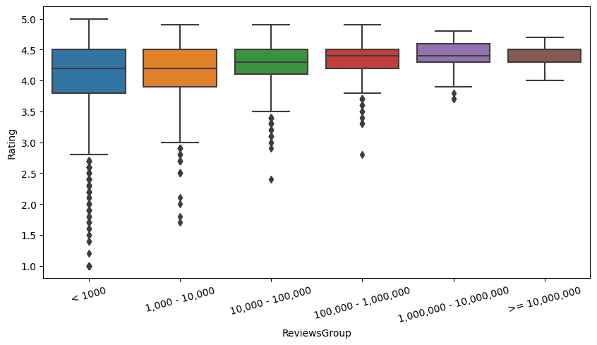

# Exploratory Data Analysis - Google Play Store Apps

https://www.kaggle.com/datasets/lava18/google-play-store-apps

## Data dictionary

|Variable|Definition|
|:-------|:-------|
App|Application name
Category|Category the app belongs to
Rating|Overall user rating of the app
Reviews|Number of user reviews for the app
Size|Size of the app (MB)|
Installs|Number of user downloads/installs for the app
Type|Paid or Free
Price|Price of the app ($)
Content Rating|Age group the app is targeted at
Genres|The app's genres (including its category)


```python
import pandas as pd # dataframes
import numpy as np # matrices and linear algebra
import matplotlib.pyplot as plt # plotting
import seaborn as sns # another matplotlib interface - styled and easier to use

import matplotlib.ticker as ticker
import re
```


```python
df = pd.read_csv('googleplaystore.csv', sep=',')
```

*Note: I corrected the category and genres for row 10472 in the dataset.*

## Basic analysis


```python
df
```


<div>
<style scoped>
    .dataframe tbody tr th:only-of-type {
        vertical-align: middle;
    }

    .dataframe tbody tr th {
        vertical-align: top;
    }

    .dataframe thead th {
        text-align: right;
    }
</style>
<table border="1" class="dataframe">
  <thead>
    <tr style="text-align: right;">
      <th></th>
      <th>App</th>
      <th>Category</th>
      <th>Rating</th>
      <th>Reviews</th>
      <th>Size</th>
      <th>Installs</th>
      <th>Type</th>
      <th>Price</th>
      <th>Content Rating</th>
      <th>Genres</th>
      <th>Last Updated</th>
      <th>Current Ver</th>
      <th>Android Ver</th>
    </tr>
  </thead>
  <tbody>
    <tr>
      <th>0</th>
      <td>Photo Editor &amp; Candy Camera &amp; Grid &amp; ScrapBook</td>
      <td>ART_AND_DESIGN</td>
      <td>4.1</td>
      <td>159</td>
      <td>19M</td>
      <td>10,000+</td>
      <td>Free</td>
      <td>0</td>
      <td>Everyone</td>
      <td>Art &amp; Design</td>
      <td>January 7, 2018</td>
      <td>1.0.0</td>
      <td>4.0.3 and up</td>
    </tr>
    <tr>
      <th>1</th>
      <td>Coloring book moana</td>
      <td>ART_AND_DESIGN</td>
      <td>3.9</td>
      <td>967</td>
      <td>14M</td>
      <td>500,000+</td>
      <td>Free</td>
      <td>0</td>
      <td>Everyone</td>
      <td>Art &amp; Design;Pretend Play</td>
      <td>January 15, 2018</td>
      <td>2.0.0</td>
      <td>4.0.3 and up</td>
    </tr>
    <tr>
      <th>2</th>
      <td>U Launcher Lite – FREE Live Cool Themes, Hide ...</td>
      <td>ART_AND_DESIGN</td>
      <td>4.7</td>
      <td>87510</td>
      <td>8.7M</td>
      <td>5,000,000+</td>
      <td>Free</td>
      <td>0</td>
      <td>Everyone</td>
      <td>Art &amp; Design</td>
      <td>August 1, 2018</td>
      <td>1.2.4</td>
      <td>4.0.3 and up</td>
    </tr>
    <tr>
      <th>3</th>
      <td>Sketch - Draw &amp; Paint</td>
      <td>ART_AND_DESIGN</td>
      <td>4.5</td>
      <td>215644</td>
      <td>25M</td>
      <td>50,000,000+</td>
      <td>Free</td>
      <td>0</td>
      <td>Teen</td>
      <td>Art &amp; Design</td>
      <td>June 8, 2018</td>
      <td>Varies with device</td>
      <td>4.2 and up</td>
    </tr>
    <tr>
      <th>4</th>
      <td>Pixel Draw - Number Art Coloring Book</td>
      <td>ART_AND_DESIGN</td>
      <td>4.3</td>
      <td>967</td>
      <td>2.8M</td>
      <td>100,000+</td>
      <td>Free</td>
      <td>0</td>
      <td>Everyone</td>
      <td>Art &amp; Design;Creativity</td>
      <td>June 20, 2018</td>
      <td>1.1</td>
      <td>4.4 and up</td>
    </tr>
    <tr>
      <th>...</th>
      <td>...</td>
      <td>...</td>
      <td>...</td>
      <td>...</td>
      <td>...</td>
      <td>...</td>
      <td>...</td>
      <td>...</td>
      <td>...</td>
      <td>...</td>
      <td>...</td>
      <td>...</td>
      <td>...</td>
    </tr>
    <tr>
      <th>10836</th>
      <td>Sya9a Maroc - FR</td>
      <td>FAMILY</td>
      <td>4.5</td>
      <td>38</td>
      <td>53M</td>
      <td>5,000+</td>
      <td>Free</td>
      <td>0</td>
      <td>Everyone</td>
      <td>Education</td>
      <td>July 25, 2017</td>
      <td>1.48</td>
      <td>4.1 and up</td>
    </tr>
    <tr>
      <th>10837</th>
      <td>Fr. Mike Schmitz Audio Teachings</td>
      <td>FAMILY</td>
      <td>5.0</td>
      <td>4</td>
      <td>3.6M</td>
      <td>100+</td>
      <td>Free</td>
      <td>0</td>
      <td>Everyone</td>
      <td>Education</td>
      <td>July 6, 2018</td>
      <td>1.0</td>
      <td>4.1 and up</td>
    </tr>
    <tr>
      <th>10838</th>
      <td>Parkinson Exercices FR</td>
      <td>MEDICAL</td>
      <td>NaN</td>
      <td>3</td>
      <td>9.5M</td>
      <td>1,000+</td>
      <td>Free</td>
      <td>0</td>
      <td>Everyone</td>
      <td>Medical</td>
      <td>January 20, 2017</td>
      <td>1.0</td>
      <td>2.2 and up</td>
    </tr>
    <tr>
      <th>10839</th>
      <td>The SCP Foundation DB fr nn5n</td>
      <td>BOOKS_AND_REFERENCE</td>
      <td>4.5</td>
      <td>114</td>
      <td>Varies with device</td>
      <td>1,000+</td>
      <td>Free</td>
      <td>0</td>
      <td>Mature 17+</td>
      <td>Books &amp; Reference</td>
      <td>January 19, 2015</td>
      <td>Varies with device</td>
      <td>Varies with device</td>
    </tr>
    <tr>
      <th>10840</th>
      <td>iHoroscope - 2018 Daily Horoscope &amp; Astrology</td>
      <td>LIFESTYLE</td>
      <td>4.5</td>
      <td>398307</td>
      <td>19M</td>
      <td>10,000,000+</td>
      <td>Free</td>
      <td>0</td>
      <td>Everyone</td>
      <td>Lifestyle</td>
      <td>July 25, 2018</td>
      <td>Varies with device</td>
      <td>Varies with device</td>
    </tr>
  </tbody>
</table>
<p>10841 rows × 13 columns</p>
</div>


```python
df = df.drop(['Last Updated', 'Current Ver', 'Android Ver'], axis=1)
```


```python
df.head(1)
```


<div>
<style scoped>
    .dataframe tbody tr th:only-of-type {
        vertical-align: middle;
    }

    .dataframe tbody tr th {
        vertical-align: top;
    }

    .dataframe thead th {
        text-align: right;
    }
</style>
<table border="1" class="dataframe">
  <thead>
    <tr style="text-align: right;">
      <th></th>
      <th>App</th>
      <th>Category</th>
      <th>Rating</th>
      <th>Reviews</th>
      <th>Size</th>
      <th>Installs</th>
      <th>Type</th>
      <th>Price</th>
      <th>Content Rating</th>
      <th>Genres</th>
    </tr>
  </thead>
  <tbody>
    <tr>
      <th>0</th>
      <td>Photo Editor &amp; Candy Camera &amp; Grid &amp; ScrapBook</td>
      <td>ART_AND_DESIGN</td>
      <td>4.1</td>
      <td>159</td>
      <td>19M</td>
      <td>10,000+</td>
      <td>Free</td>
      <td>0</td>
      <td>Everyone</td>
      <td>Art &amp; Design</td>
    </tr>
  </tbody>
</table>
</div>


```python
df.shape
```


    (10841, 10)


```python
df.isna().sum().sort_values(ascending=False)
```


    Rating            1474
    Type                 1
    App                  0
    Category             0
    Reviews              0
    Size                 0
    Installs             0
    Price                0
    Content Rating       0
    Genres               0
    dtype: int64


```python
df.dtypes
```


    App                object
    Category           object
    Rating            float64
    Reviews             int64
    Size               object
    Installs           object
    Type               object
    Price              object
    Content Rating     object
    Genres             object
    dtype: object


```python
# df.describe(exclude=np.number)
print(f'Column: Unique values')
for col in df.select_dtypes(exclude=np.number):
    print(f'{col}: {df[col].unique().shape[0]}')
```

    Column: Unique values
    App: 9660
    Category: 33
    Size: 461
    Installs: 21
    Type: 3
    Price: 92
    Content Rating: 6
    Genres: 119
    

### Remove duplicate apps


```python
df_count = df.groupby('App').App.count().reset_index(name='Count')
df_count.loc[df_count.Count > 1, :]
```


<div>
<style scoped>
    .dataframe tbody tr th:only-of-type {
        vertical-align: middle;
    }

    .dataframe tbody tr th {
        vertical-align: top;
    }

    .dataframe thead th {
        text-align: right;
    }
</style>
<table border="1" class="dataframe">
  <thead>
    <tr style="text-align: right;">
      <th></th>
      <th>App</th>
      <th>Count</th>
    </tr>
  </thead>
  <tbody>
    <tr>
      <th>7</th>
      <td>10 Best Foods for You</td>
      <td>2</td>
    </tr>
    <tr>
      <th>20</th>
      <td>1800 Contacts - Lens Store</td>
      <td>2</td>
    </tr>
    <tr>
      <th>29</th>
      <td>2017 EMRA Antibiotic Guide</td>
      <td>2</td>
    </tr>
    <tr>
      <th>35</th>
      <td>21-Day Meditation Experience</td>
      <td>2</td>
    </tr>
    <tr>
      <th>57</th>
      <td>365Scores - Live Scores</td>
      <td>2</td>
    </tr>
    <tr>
      <th>...</th>
      <td>...</td>
      <td>...</td>
    </tr>
    <tr>
      <th>9585</th>
      <td>stranger chat - anonymous chat</td>
      <td>2</td>
    </tr>
    <tr>
      <th>9592</th>
      <td>textPlus: Free Text &amp; Calls</td>
      <td>2</td>
    </tr>
    <tr>
      <th>9597</th>
      <td>theScore: Live Sports Scores, News, Stats &amp; Vi...</td>
      <td>5</td>
    </tr>
    <tr>
      <th>9602</th>
      <td>trivago: Hotels &amp; Travel</td>
      <td>3</td>
    </tr>
    <tr>
      <th>9620</th>
      <td>wetter.com - Weather and Radar</td>
      <td>2</td>
    </tr>
  </tbody>
</table>
<p>798 rows × 2 columns</p>
</div>


```python
df.loc[df.App == '365Scores - Live Scores', :]
```


<div>
<style scoped>
    .dataframe tbody tr th:only-of-type {
        vertical-align: middle;
    }

    .dataframe tbody tr th {
        vertical-align: top;
    }

    .dataframe thead th {
        text-align: right;
    }
</style>
<table border="1" class="dataframe">
  <thead>
    <tr style="text-align: right;">
      <th></th>
      <th>App</th>
      <th>Category</th>
      <th>Rating</th>
      <th>Reviews</th>
      <th>Size</th>
      <th>Installs</th>
      <th>Type</th>
      <th>Price</th>
      <th>Content Rating</th>
      <th>Genres</th>
    </tr>
  </thead>
  <tbody>
    <tr>
      <th>3083</th>
      <td>365Scores - Live Scores</td>
      <td>SPORTS</td>
      <td>4.6</td>
      <td>666521</td>
      <td>25M</td>
      <td>10,000,000+</td>
      <td>Free</td>
      <td>0</td>
      <td>Everyone</td>
      <td>Sports</td>
    </tr>
    <tr>
      <th>5415</th>
      <td>365Scores - Live Scores</td>
      <td>SPORTS</td>
      <td>4.6</td>
      <td>666246</td>
      <td>25M</td>
      <td>10,000,000+</td>
      <td>Free</td>
      <td>0</td>
      <td>Everyone</td>
      <td>Sports</td>
    </tr>
  </tbody>
</table>
</div>


```python
df = df.drop_duplicates(subset=['App'])
```


```python
df_count = df.groupby('App').App.count().reset_index(name='Count')
df_count.loc[df_count.Count > 1, :]
```


<div>
<style scoped>
    .dataframe tbody tr th:only-of-type {
        vertical-align: middle;
    }

    .dataframe tbody tr th {
        vertical-align: top;
    }

    .dataframe thead th {
        text-align: right;
    }
</style>
<table border="1" class="dataframe">
  <thead>
    <tr style="text-align: right;">
      <th></th>
      <th>App</th>
      <th>Count</th>
    </tr>
  </thead>
  <tbody>
  </tbody>
</table>
</div>


### Convert Installs into numbers


```python
df.Installs.unique()
```


    array(['10,000+', '500,000+', '5,000,000+', '50,000,000+', '100,000+',
           '50,000+', '1,000,000+', '10,000,000+', '5,000+', '100,000,000+',
           '1,000,000,000+', '1,000+', '500,000,000+', '50+', '100+', '500+',
           '10+', '1+', '5+', '0+', '0'], dtype=object)


```python
df.Installs.apply(lambda x: int(x.replace(',', '').replace('+', ''))).unique()
```


    array([     10000,     500000,    5000000,   50000000,     100000,
                50000,    1000000,   10000000,       5000,  100000000,
           1000000000,       1000,  500000000,         50,        100,
                  500,         10,          1,          5,          0],
          dtype=int64)


```python
df.Installs = df.Installs.apply(lambda x: int(x.replace(',', '').replace('+', '')))
```


```python
df = df.sort_values(by=['Installs'], ascending=False)
```

### Convert Size into numbers


```python
df.Size.apply(lambda x: x[-1]).unique()
```


    array(['e', 'M', 'k'], dtype=object)


```python
df.loc[df.Size.apply(lambda x: x[-1]) == 'e', 'Size']
```


    336     Varies with device
    152     Varies with device
    3117    Varies with device
    340     Varies with device
    2545    Varies with device
                   ...        
    9417    Varies with device
    4218    Varies with device
    6277    Varies with device
    6479    Varies with device
    9148    Varies with device
    Name: Size, Length: 1227, dtype: object


```python
def convert_size(x):
    if x == 'Varies with device':
        return float("NaN")
    
    unit = x[-1]
    value = float(x[:-1])
    if unit == 'k':
        return value / 1000 # 1024?
    return value
```


```python
df.Size = df.Size.apply(convert_size)
```

### Convert Price into numbers


```python
df.Price.unique()
```


    array(['0', '$6.99', '$0.99', '$2.99', '$4.99', '$1.99', '$5.99', '$2.49',
           '$3.99', '$13.99', '$14.99', '$9.99', '$24.99', '$8.99', '$9.00',
           '$11.99', '$3.49', '$1.49', '$2.90', '$7.99', '$3.95', '$4.49',
           '$399.99', '$29.99', '$19.99', '$4.77', '$3.90', '$12.99', '$2.95',
           '$16.99', '$1.97', '$1.20', '$3.28', '$17.99', '$2.59', '$1.59',
           '$2.50', '$10.00', '$299.99', '$18.99', '$389.99', '$5.49',
           '$400.00', '$4.60', '$1.00', '$79.99', '$7.49', '$37.99',
           '$379.99', '$8.49', '$4.29', '$74.99', '$2.56', '$1.70', '$4.84',
           '$1.61', '$1.29', '$33.99', '$10.99', '$1.50', '$3.08', '$15.46',
           '$19.40', '$15.99', '$2.00', '$3.88', '$4.59', '$39.99', '$1.26',
           '$6.49', '$5.00', '$19.90', '$14.00', '$3.02', '$1.76', '$1.04',
           '$2.60', '$4.85', '$1.75', '$3.04', '$46.99', '$25.99', '$3.61',
           '$89.99', '$1.96', '$4.80', '$28.99', '$109.99', '$154.99',
           '$30.99', '$200.00', '$394.99'], dtype=object)


```python
df.Price.apply(lambda x: x[0]).unique()
```


    array(['0', '$'], dtype=object)


```python
df.Price = df.Price.apply(lambda x: 0 if x == '0' else float(x[1:]))
```

### Simplify Content Rating


```python
df['Content Rating'].value_counts()
```


    Everyone           7904
    Teen               1036
    Mature 17+          393
    Everyone 10+        322
    Adults only 18+       3
    Unrated               2
    Name: Content Rating, dtype: int64


```python
df.loc[df['Content Rating'] == 'Everyone 10+'].head(3)
```


<div>
<style scoped>
    .dataframe tbody tr th:only-of-type {
        vertical-align: middle;
    }

    .dataframe tbody tr th {
        vertical-align: top;
    }

    .dataframe thead th {
        text-align: right;
    }
</style>
<table border="1" class="dataframe">
  <thead>
    <tr style="text-align: right;">
      <th></th>
      <th>App</th>
      <th>Category</th>
      <th>Rating</th>
      <th>Reviews</th>
      <th>Size</th>
      <th>Installs</th>
      <th>Type</th>
      <th>Price</th>
      <th>Content Rating</th>
      <th>Genres</th>
    </tr>
  </thead>
  <tbody>
    <tr>
      <th>1654</th>
      <td>Subway Surfers</td>
      <td>GAME</td>
      <td>4.5</td>
      <td>27722264</td>
      <td>76.0</td>
      <td>1000000000</td>
      <td>Free</td>
      <td>0.0</td>
      <td>Everyone 10+</td>
      <td>Arcade</td>
    </tr>
    <tr>
      <th>3755</th>
      <td>Flipboard: News For Our Time</td>
      <td>NEWS_AND_MAGAZINES</td>
      <td>4.4</td>
      <td>1284017</td>
      <td>NaN</td>
      <td>500000000</td>
      <td>Free</td>
      <td>0.0</td>
      <td>Everyone 10+</td>
      <td>News &amp; Magazines</td>
    </tr>
    <tr>
      <th>4111</th>
      <td>Talking Tom Cat 2</td>
      <td>FAMILY</td>
      <td>4.3</td>
      <td>3213548</td>
      <td>55.0</td>
      <td>100000000</td>
      <td>Free</td>
      <td>0.0</td>
      <td>Everyone 10+</td>
      <td>Entertainment</td>
    </tr>
  </tbody>
</table>
</div>


```python
df.loc[df['Content Rating'] == 'Unrated', 'Content Rating'] = 'Everyone'
df.loc[df['Content Rating'] == 'Everyone 10+', 'Content Rating'] = 'Teen'
df.loc[df['Content Rating'] == 'Adults only 18+', 'Content Rating'] = 'Mature'
df.loc[df['Content Rating'] == 'Mature 17+', 'Content Rating'] = 'Mature'
df['Content Rating'].value_counts()
```


    Everyone    7906
    Teen        1358
    Mature       396
    Name: Content Rating, dtype: int64


```python
sns.countplot(x=df['Content Rating'])
```


    <AxesSubplot: xlabel='Content Rating', ylabel='count'>


    

    


```python
df
```


<div>
<style scoped>
    .dataframe tbody tr th:only-of-type {
        vertical-align: middle;
    }

    .dataframe tbody tr th {
        vertical-align: top;
    }

    .dataframe thead th {
        text-align: right;
    }
</style>
<table border="1" class="dataframe">
  <thead>
    <tr style="text-align: right;">
      <th></th>
      <th>App</th>
      <th>Category</th>
      <th>Rating</th>
      <th>Reviews</th>
      <th>Size</th>
      <th>Installs</th>
      <th>Type</th>
      <th>Price</th>
      <th>Content Rating</th>
      <th>Genres</th>
    </tr>
  </thead>
  <tbody>
    <tr>
      <th>336</th>
      <td>WhatsApp Messenger</td>
      <td>COMMUNICATION</td>
      <td>4.4</td>
      <td>69119316</td>
      <td>NaN</td>
      <td>1000000000</td>
      <td>Free</td>
      <td>0.00</td>
      <td>Everyone</td>
      <td>Communication</td>
    </tr>
    <tr>
      <th>152</th>
      <td>Google Play Books</td>
      <td>BOOKS_AND_REFERENCE</td>
      <td>3.9</td>
      <td>1433233</td>
      <td>NaN</td>
      <td>1000000000</td>
      <td>Free</td>
      <td>0.00</td>
      <td>Teen</td>
      <td>Books &amp; Reference</td>
    </tr>
    <tr>
      <th>1654</th>
      <td>Subway Surfers</td>
      <td>GAME</td>
      <td>4.5</td>
      <td>27722264</td>
      <td>76.0</td>
      <td>1000000000</td>
      <td>Free</td>
      <td>0.00</td>
      <td>Teen</td>
      <td>Arcade</td>
    </tr>
    <tr>
      <th>3117</th>
      <td>Maps - Navigate &amp; Explore</td>
      <td>TRAVEL_AND_LOCAL</td>
      <td>4.3</td>
      <td>9235155</td>
      <td>NaN</td>
      <td>1000000000</td>
      <td>Free</td>
      <td>0.00</td>
      <td>Everyone</td>
      <td>Travel &amp; Local</td>
    </tr>
    <tr>
      <th>340</th>
      <td>Gmail</td>
      <td>COMMUNICATION</td>
      <td>4.3</td>
      <td>4604324</td>
      <td>NaN</td>
      <td>1000000000</td>
      <td>Free</td>
      <td>0.00</td>
      <td>Everyone</td>
      <td>Communication</td>
    </tr>
    <tr>
      <th>...</th>
      <td>...</td>
      <td>...</td>
      <td>...</td>
      <td>...</td>
      <td>...</td>
      <td>...</td>
      <td>...</td>
      <td>...</td>
      <td>...</td>
      <td>...</td>
    </tr>
    <tr>
      <th>9719</th>
      <td>EP Cook Book</td>
      <td>MEDICAL</td>
      <td>NaN</td>
      <td>0</td>
      <td>3.2</td>
      <td>0</td>
      <td>Paid</td>
      <td>200.00</td>
      <td>Everyone</td>
      <td>Medical</td>
    </tr>
    <tr>
      <th>9917</th>
      <td>Eu Sou Rico</td>
      <td>FINANCE</td>
      <td>NaN</td>
      <td>0</td>
      <td>1.4</td>
      <td>0</td>
      <td>Paid</td>
      <td>394.99</td>
      <td>Everyone</td>
      <td>Finance</td>
    </tr>
    <tr>
      <th>7434</th>
      <td>Pekalongan CJ</td>
      <td>SOCIAL</td>
      <td>NaN</td>
      <td>0</td>
      <td>5.9</td>
      <td>0</td>
      <td>Free</td>
      <td>0.00</td>
      <td>Teen</td>
      <td>Social</td>
    </tr>
    <tr>
      <th>9337</th>
      <td>EG | Explore Folegandros</td>
      <td>TRAVEL_AND_LOCAL</td>
      <td>NaN</td>
      <td>0</td>
      <td>56.0</td>
      <td>0</td>
      <td>Paid</td>
      <td>3.99</td>
      <td>Everyone</td>
      <td>Travel &amp; Local</td>
    </tr>
    <tr>
      <th>5486</th>
      <td>AP Series Solution Pro</td>
      <td>FAMILY</td>
      <td>NaN</td>
      <td>0</td>
      <td>7.4</td>
      <td>0</td>
      <td>Paid</td>
      <td>1.99</td>
      <td>Everyone</td>
      <td>Education</td>
    </tr>
  </tbody>
</table>
<p>9660 rows × 10 columns</p>
</div>


### Numeric columns


```python
df.describe()
```


<div>
<style scoped>
    .dataframe tbody tr th:only-of-type {
        vertical-align: middle;
    }

    .dataframe tbody tr th {
        vertical-align: top;
    }

    .dataframe thead th {
        text-align: right;
    }
</style>
<table border="1" class="dataframe">
  <thead>
    <tr style="text-align: right;">
      <th></th>
      <th>Rating</th>
      <th>Reviews</th>
      <th>Size</th>
      <th>Installs</th>
      <th>Price</th>
    </tr>
  </thead>
  <tbody>
    <tr>
      <th>count</th>
      <td>8197.000000</td>
      <td>9.660000e+03</td>
      <td>8433.000000</td>
      <td>9.660000e+03</td>
      <td>9660.000000</td>
    </tr>
    <tr>
      <th>mean</th>
      <td>4.172966</td>
      <td>2.165701e+05</td>
      <td>20.393227</td>
      <td>7.776702e+06</td>
      <td>1.099185</td>
    </tr>
    <tr>
      <th>std</th>
      <td>0.537179</td>
      <td>1.831226e+06</td>
      <td>21.827070</td>
      <td>5.375555e+07</td>
      <td>16.851283</td>
    </tr>
    <tr>
      <th>min</th>
      <td>1.000000</td>
      <td>0.000000e+00</td>
      <td>0.008500</td>
      <td>0.000000e+00</td>
      <td>0.000000</td>
    </tr>
    <tr>
      <th>25%</th>
      <td>4.000000</td>
      <td>2.500000e+01</td>
      <td>4.600000</td>
      <td>1.000000e+03</td>
      <td>0.000000</td>
    </tr>
    <tr>
      <th>50%</th>
      <td>4.300000</td>
      <td>9.670000e+02</td>
      <td>12.000000</td>
      <td>1.000000e+05</td>
      <td>0.000000</td>
    </tr>
    <tr>
      <th>75%</th>
      <td>4.500000</td>
      <td>2.939400e+04</td>
      <td>28.000000</td>
      <td>1.000000e+06</td>
      <td>0.000000</td>
    </tr>
    <tr>
      <th>max</th>
      <td>5.000000</td>
      <td>7.815831e+07</td>
      <td>100.000000</td>
      <td>1.000000e+09</td>
      <td>400.000000</td>
    </tr>
  </tbody>
</table>
</div>


```python
cols = df.select_dtypes(include=np.number).columns
fig, ax = plt.subplots(len(cols), 2, figsize=(12, len(cols) * 4))
ax = ax.flatten()
for i, col in enumerate(cols):
  sns.boxplot(data=df, y=col, ax=ax[i * 2])
  sns.boxplot(data=df, y=col, ax=ax[i * 2 + 1], showfliers=False)
  if i == 0:
      ax[i * 2].set_title('With outliers')
      ax[i * 2 + 1].set_title('Without outliers')
plt.show()

```


    

    


```python
plt.figure(figsize=(12, 9))
sns.heatmap(df.corr(), square=True, cmap='RdYlGn', vmin=-1, vmax=1, annot=True)
```

    C:\Users\28D\AppData\Local\Temp\ipykernel_8252\2383890127.py:2: FutureWarning: The default value of numeric_only in DataFrame.corr is deprecated. In a future version, it will default to False. Select only valid columns or specify the value of numeric_only to silence this warning.
      sns.heatmap(df.corr(), square=True, cmap='RdYlGn', vmin=-1, vmax=1, annot=True)
    


    <AxesSubplot: >


    

    


### Type


```python
df.Type.value_counts()
```


    Free    8903
    Paid     756
    Name: Type, dtype: int64


```python
sns.countplot(x=df.Type)
```


    <AxesSubplot: xlabel='Type', ylabel='count'>


    

    


### Category


```python
df.Category.value_counts()
```


    FAMILY                 1832
    GAME                    959
    TOOLS                   827
    BUSINESS                420
    MEDICAL                 395
    PERSONALIZATION         376
    PRODUCTIVITY            374
    LIFESTYLE               370
    FINANCE                 345
    SPORTS                  325
    COMMUNICATION           315
    HEALTH_AND_FITNESS      288
    PHOTOGRAPHY             281
    NEWS_AND_MAGAZINES      254
    SOCIAL                  239
    BOOKS_AND_REFERENCE     222
    TRAVEL_AND_LOCAL        219
    SHOPPING                202
    DATING                  171
    VIDEO_PLAYERS           163
    MAPS_AND_NAVIGATION     131
    EDUCATION               119
    FOOD_AND_DRINK          112
    ENTERTAINMENT           102
    AUTO_AND_VEHICLES        85
    LIBRARIES_AND_DEMO       84
    WEATHER                  79
    HOUSE_AND_HOME           74
    ART_AND_DESIGN           64
    EVENTS                   64
    PARENTING                60
    COMICS                   56
    BEAUTY                   53
    Name: Category, dtype: int64


```python
df.loc[df.Category == 'FAMILY', 'Content Rating'].value_counts()
```


    Everyone    1432
    Teen         350
    Mature        50
    Name: Content Rating, dtype: int64


```python
df.loc[(df.Category == 'FAMILY') & (df['Content Rating'] == 'Mature'), :].head(5)
```


<div>
<style scoped>
    .dataframe tbody tr th:only-of-type {
        vertical-align: middle;
    }

    .dataframe tbody tr th {
        vertical-align: top;
    }

    .dataframe thead th {
        text-align: right;
    }
</style>
<table border="1" class="dataframe">
  <thead>
    <tr style="text-align: right;">
      <th></th>
      <th>App</th>
      <th>Category</th>
      <th>Rating</th>
      <th>Reviews</th>
      <th>Size</th>
      <th>Installs</th>
      <th>Type</th>
      <th>Price</th>
      <th>Content Rating</th>
      <th>Genres</th>
    </tr>
  </thead>
  <tbody>
    <tr>
      <th>5049</th>
      <td>iFunny :)</td>
      <td>FAMILY</td>
      <td>4.4</td>
      <td>503757</td>
      <td>NaN</td>
      <td>10000000</td>
      <td>Free</td>
      <td>0.0</td>
      <td>Mature</td>
      <td>Entertainment</td>
    </tr>
    <tr>
      <th>8443</th>
      <td>Meme Generator Free</td>
      <td>FAMILY</td>
      <td>4.4</td>
      <td>303394</td>
      <td>53.0</td>
      <td>10000000</td>
      <td>Free</td>
      <td>0.0</td>
      <td>Mature</td>
      <td>Entertainment</td>
    </tr>
    <tr>
      <th>5865</th>
      <td>Gangster Town: Vice District</td>
      <td>FAMILY</td>
      <td>4.3</td>
      <td>65146</td>
      <td>100.0</td>
      <td>10000000</td>
      <td>Free</td>
      <td>0.0</td>
      <td>Mature</td>
      <td>Simulation</td>
    </tr>
    <tr>
      <th>5425</th>
      <td>Virtual Cigarette Smoking (prank)</td>
      <td>FAMILY</td>
      <td>3.7</td>
      <td>29838</td>
      <td>NaN</td>
      <td>5000000</td>
      <td>Free</td>
      <td>0.0</td>
      <td>Mature</td>
      <td>Entertainment</td>
    </tr>
    <tr>
      <th>5422</th>
      <td>High School Simulator 2017</td>
      <td>FAMILY</td>
      <td>4.2</td>
      <td>123136</td>
      <td>80.0</td>
      <td>5000000</td>
      <td>Free</td>
      <td>0.0</td>
      <td>Mature</td>
      <td>Simulation</td>
    </tr>
  </tbody>
</table>
</div>


#### The Family category is the most popular. From what I've found it should be a general category for apps and games for kids, but there are apparently even Mature apps. It seems kind of useless, so I will replace it with the first Genre of each app.


```python
df.loc[df.Category == 'FAMILY'].Genres.value_counts().head(10)
```


    Entertainment            469
    Education                411
    Simulation               183
    Casual                   142
    Puzzle                    95
    Role Playing              90
    Strategy                  78
    Educational;Education     38
    Educational               37
    Education;Education       28
    Name: Genres, dtype: int64


```python
df.loc[df.Category == 'FAMILY'].Genres.str.extract(r'([^;]+);?').value_counts().head(20)
```


    Entertainment              490
    Education                  461
    Casual                     198
    Simulation                 194
    Puzzle                     118
    Educational                102
    Role Playing               100
    Strategy                    82
    Board                       19
    Racing                      17
    Arcade                      15
    Action                       9
    Adventure                    6
    Sports                       4
    Books & Reference            3
    Music                        3
    Health & Fitness             2
    Card                         2
    Video Players & Editors      2
    Music & Audio                1
    dtype: int64


Concrete genres of games will have to be assigned to the GAME category. 


```python
def genre_to_category(x):
    return re.search(r'([^;]+);?', x).group(1).replace(' ', '_').replace('&', 'AND').upper()
```


```python
cats = df.loc[df.Category == 'FAMILY'].Genres.str.extract(r'([^;]+);?', expand=False).apply(genre_to_category)
cats.loc[~cats.isin(df.Category.unique())].value_counts()
```


    CASUAL                       198
    SIMULATION                   194
    PUZZLE                       118
    EDUCATIONAL                  102
    ROLE_PLAYING                 100
    STRATEGY                      82
    BOARD                         19
    RACING                        17
    ARCADE                        15
    ACTION                         9
    ADVENTURE                      6
    MUSIC                          3
    CARD                           2
    VIDEO_PLAYERS_AND_EDITORS      2
    MUSIC_AND_AUDIO                1
    TRIVIA                         1
    Name: Genres, dtype: int64


```python
df.loc[(df.Category == 'FAMILY') & (df.Genres.str.match(r'^Music', na=False))]
```


<div>
<style scoped>
    .dataframe tbody tr th:only-of-type {
        vertical-align: middle;
    }

    .dataframe tbody tr th {
        vertical-align: top;
    }

    .dataframe thead th {
        text-align: right;
    }
</style>
<table border="1" class="dataframe">
  <thead>
    <tr style="text-align: right;">
      <th></th>
      <th>App</th>
      <th>Category</th>
      <th>Rating</th>
      <th>Reviews</th>
      <th>Size</th>
      <th>Installs</th>
      <th>Type</th>
      <th>Price</th>
      <th>Content Rating</th>
      <th>Genres</th>
    </tr>
  </thead>
  <tbody>
    <tr>
      <th>2051</th>
      <td>Piano Kids - Music &amp; Songs</td>
      <td>FAMILY</td>
      <td>4.6</td>
      <td>46741</td>
      <td>50.0</td>
      <td>10000000</td>
      <td>Free</td>
      <td>0.00</td>
      <td>Everyone</td>
      <td>Music;Music &amp; Video</td>
    </tr>
    <tr>
      <th>2142</th>
      <td>Toy Guitar with songs for kids</td>
      <td>FAMILY</td>
      <td>4.3</td>
      <td>1369</td>
      <td>9.8</td>
      <td>500000</td>
      <td>Free</td>
      <td>0.00</td>
      <td>Everyone</td>
      <td>Music &amp; Audio;Music &amp; Video</td>
    </tr>
    <tr>
      <th>2060</th>
      <td>Rhythm Patrol</td>
      <td>FAMILY</td>
      <td>4.3</td>
      <td>4207</td>
      <td>26.0</td>
      <td>100000</td>
      <td>Free</td>
      <td>0.00</td>
      <td>Everyone</td>
      <td>Music;Music &amp; Video</td>
    </tr>
    <tr>
      <th>9470</th>
      <td>Learn Music Notes</td>
      <td>FAMILY</td>
      <td>4.7</td>
      <td>143</td>
      <td>4.4</td>
      <td>1000</td>
      <td>Paid</td>
      <td>1.99</td>
      <td>Everyone</td>
      <td>Music;Music &amp; Video</td>
    </tr>
  </tbody>
</table>
</div>


```python
unique_cats = df.Category.unique()
def genre_to_category(x):
    cat = re.search(r'([^;]+)', x).group(1).replace(' ', '_').replace('&', 'AND').upper()
    if cat == 'VIDEO_PLAYERS_AND_EDITORS':
        return 'VIDEO_PLAYERS'
    elif cat not in unique_cats:
        return 'GAME'
    return cat
```


```python
df.apply(lambda x: x.Category if x.Category != 'FAMILY' else genre_to_category(x.Genres), axis=1)
```


    336           COMMUNICATION
    152     BOOKS_AND_REFERENCE
    1654                   GAME
    3117       TRAVEL_AND_LOCAL
    340           COMMUNICATION
                   ...         
    9719                MEDICAL
    9917                FINANCE
    7434                 SOCIAL
    9337       TRAVEL_AND_LOCAL
    5486              EDUCATION
    Length: 9660, dtype: object


```python
df.Category = df.apply(lambda x: x.Category if x.Category != 'FAMILY' else genre_to_category(x.Genres), axis=1)
df.Category.value_counts()
```


    GAME                   1826
    TOOLS                   827
    ENTERTAINMENT           592
    EDUCATION               580
    BUSINESS                420
    MEDICAL                 395
    PERSONALIZATION         376
    PRODUCTIVITY            374
    LIFESTYLE               371
    FINANCE                 345
    SPORTS                  329
    COMMUNICATION           316
    HEALTH_AND_FITNESS      290
    PHOTOGRAPHY             281
    NEWS_AND_MAGAZINES      254
    SOCIAL                  239
    BOOKS_AND_REFERENCE     225
    TRAVEL_AND_LOCAL        219
    SHOPPING                202
    DATING                  171
    VIDEO_PLAYERS           165
    MAPS_AND_NAVIGATION     131
    FOOD_AND_DRINK          112
    AUTO_AND_VEHICLES        85
    LIBRARIES_AND_DEMO       84
    WEATHER                  79
    HOUSE_AND_HOME           74
    ART_AND_DESIGN           65
    EVENTS                   64
    PARENTING                60
    COMICS                   56
    BEAUTY                   53
    Name: Category, dtype: int64


## Hypotheses/Questions
1. Which categories contain the most apps? Which game genres are the most common?
2. Which categories and game genres have the most installs in total and on average?
3. What's the relationship between an app's rating and the number of reviews?
4. What's the relationship between the number of installs and reviews?
5. Do rating and number of installs differ between games and apps?
6. Are games reviewed more often than apps (non-games)?
7. Are paid apps reviewed more often than free apps?

### 1. Which categories contain the most apps? Which game genres are the most common?


```python
plt.figure(figsize=(20,5))
plt.xticks(rotation=60)
sns.countplot(x=df.Category, order=df.Category.value_counts().index)
```


    <AxesSubplot: xlabel='Category', ylabel='count'>


    

    


```python
df.loc[df.Category == 'GAME'].App.count() / df.App.count()
```


    0.18902691511387162


Games make up 19 % of apps. Tools, Entertainment, and Education are categories with the most non-game apps (500+), though there is a decent number of categories with at least 250 apps.


```python
df_games = df.loc[df.Category == 'GAME'].copy()
df_games['Genre'] = df_games.Genres.apply(lambda x: re.search(r'([^;]+)', x).group(1))
```


```python
plt.figure(figsize=(15,5))
plt.xticks(rotation=60)
plt.title('The first/primary genre of each game')
sns.countplot(x=df_games['Genre'], order=df_games['Genre'].value_counts().index)
```


    <AxesSubplot: title={'center': 'The first/primary genre of each game'}, xlabel='Genre', ylabel='count'>


    

    


```python
df_games.loc[(df.Genres.str.contains(';'))].App.count()
```


    252


The are 252 games with more than one genre, so I will also make a bar chart representing all genres of each game.


```python
exploded_game_genres = df_games.Genres.apply(lambda x: x.split(';')).explode()
```


```python
exploded_game_genres.value_counts()
```


    Action                311
    Casual                225
    Simulation            206
    Arcade                199
    Puzzle                142
    Role Playing          115
    Racing                108
    Educational           102
    Strategy               99
    Action & Adventure     84
    Adventure              80
    Board                  60
    Brain Games            52
    Card                   49
    Education              49
    Pretend Play           48
    Trivia                 39
    Casino                 39
    Word                   23
    Music                  22
    Creativity             14
    Sports                  6
    Music & Video           5
    Music & Audio           1
    Name: Genres, dtype: int64


```python
plt.figure(figsize=(15,5))
plt.xticks(rotation=60)
plt.title('All genres of each game')
sns.countplot(x=exploded_game_genres, order=exploded_game_genres.value_counts().index)
```


    <AxesSubplot: title={'center': 'All genres of each game'}, xlabel='Genres', ylabel='count'>


    

    


Action games are the most common, followed by casual, simulation, arcade, and puzzle games.

### 2. Which categories and game genres have the most installs in total and on average?


```python
aggs = ('Total', 'Mean', 'Median')
df_installs = df.groupby('Category').Installs.agg(Mean='mean', Median='median', Total='sum').reset_index()
top_n = 10
for agg in aggs:
    df_top_installs = df_installs.nlargest(top_n, agg)
    fig, ax = plt.subplots(1, 2, figsize=(20,3))
    ax[0].tick_params(labelrotation=60)
    ax[0].set_title(f'Categories ordered by {agg.lower()} installs (top {top_n})') 
    sns.barplot(data=df_top_installs, x='Category', y=agg, ax=ax[0])
    ax[1].tick_params(labelrotation=60)
    ax[1].set_title('Box plot for categories shown in the bar plot on the left')
    sns.boxplot(data=df.loc[df.Category.isin(df_top_installs.Category)], x='Category', y='Installs', ax=ax[1], showmeans=False, showfliers=False, order=df_top_installs.Category)
```


    

    


    

    


    

    


Games have the most installs in total, followed by communication and tools apps. Communication apps have highest mean installs, followed by video players and social apps. Games, photography apps, shopping apps, video players, and weather apps have the highest median installs (1 million).


```python
aggs = ('Total', 'Mean', 'Median')
df_installs = df_games.groupby('Genre').Installs.agg(Mean='mean', Median='median', Total='sum').reset_index()
top_n = 10
for agg in aggs:
    df_top_installs = df_installs.nlargest(top_n, agg)
    fig, ax = plt.subplots(1, 2, figsize=(20,3))
    ax[0].tick_params(labelrotation=60)
    ax[0].set_title(f'Genres ordered by {agg.lower()} installs (top {top_n})') 
    sns.barplot(data=df_top_installs, x='Genre', y=agg, ax=ax[0])
    ax[1].tick_params(labelrotation=60)
    ax[1].set_title('Box plot for genres shown in the bar plot on the left')
    sns.boxplot(data=df_games.loc[df_games.Genre.isin(df_top_installs.Genre)], x='Genre', y='Installs', ax=ax[1], showmeans=False, showfliers=False, order=df_top_installs.Genre)
```


    

    


    

    


    

    


```python
df_games.loc[df_games.Genre == 'Sports']
```


<div>
<style scoped>
    .dataframe tbody tr th:only-of-type {
        vertical-align: middle;
    }

    .dataframe tbody tr th {
        vertical-align: top;
    }

    .dataframe thead th {
        text-align: right;
    }
</style>
<table border="1" class="dataframe">
  <thead>
    <tr style="text-align: right;">
      <th></th>
      <th>App</th>
      <th>Category</th>
      <th>Rating</th>
      <th>Reviews</th>
      <th>Size</th>
      <th>Installs</th>
      <th>Type</th>
      <th>Price</th>
      <th>Content Rating</th>
      <th>Genres</th>
      <th>Genre</th>
    </tr>
  </thead>
  <tbody>
    <tr>
      <th>1675</th>
      <td>8 Ball Pool</td>
      <td>GAME</td>
      <td>4.5</td>
      <td>14198297</td>
      <td>52.0</td>
      <td>100000000</td>
      <td>Free</td>
      <td>0.0</td>
      <td>Everyone</td>
      <td>Sports</td>
      <td>Sports</td>
    </tr>
    <tr>
      <th>1739</th>
      <td>Dream League Soccer 2018</td>
      <td>GAME</td>
      <td>4.6</td>
      <td>9882639</td>
      <td>74.0</td>
      <td>100000000</td>
      <td>Free</td>
      <td>0.0</td>
      <td>Everyone</td>
      <td>Sports</td>
      <td>Sports</td>
    </tr>
    <tr>
      <th>1709</th>
      <td>Score! Hero</td>
      <td>GAME</td>
      <td>4.6</td>
      <td>5418675</td>
      <td>96.0</td>
      <td>100000000</td>
      <td>Free</td>
      <td>0.0</td>
      <td>Everyone</td>
      <td>Sports</td>
      <td>Sports</td>
    </tr>
    <tr>
      <th>1692</th>
      <td>Shooting King</td>
      <td>GAME</td>
      <td>4.4</td>
      <td>257724</td>
      <td>69.0</td>
      <td>10000000</td>
      <td>Free</td>
      <td>0.0</td>
      <td>Teen</td>
      <td>Sports</td>
      <td>Sports</td>
    </tr>
    <tr>
      <th>1793</th>
      <td>Mini Golf King - Multiplayer Game</td>
      <td>GAME</td>
      <td>4.5</td>
      <td>531458</td>
      <td>100.0</td>
      <td>5000000</td>
      <td>Free</td>
      <td>0.0</td>
      <td>Everyone</td>
      <td>Sports</td>
      <td>Sports</td>
    </tr>
    <tr>
      <th>1811</th>
      <td>MLB TAP SPORTS BASEBALL 2018</td>
      <td>GAME</td>
      <td>4.6</td>
      <td>32506</td>
      <td>82.0</td>
      <td>1000000</td>
      <td>Free</td>
      <td>0.0</td>
      <td>Everyone</td>
      <td>Sports</td>
      <td>Sports</td>
    </tr>
  </tbody>
</table>
</div>


The most installed game genres are arcade, action, and casual. Sports games have the most installs on average (there were only a few of them in the dataset for some reason).

### 3. What's the relationship between an app's rating and the number of reviews?


```python
fig, ax = plt.subplots(1, 2, figsize=((16,8)))
sns.regplot(y="Rating", x="Reviews", 
                    data=df,
                    scatter_kws={'alpha':0.15},
                    fit_reg=False,
                    ax=ax[0])
ax[0].set_title('Linear scale')
splot = sns.regplot(y="Rating", x="Reviews", 
                    data=df,
                    scatter_kws={'alpha':0.15},
                    fit_reg=False,
                    ax=ax[1])
splot.set(xscale="log")
ax[1].set_title('Logarithmic scale')
```


    Text(0.5, 1.0, 'Logarithmic scale')


    

    


```python
df['ReviewsGroup'] = '< 1000'
df.loc[df.Reviews >= 1000, 'ReviewsGroup'] = '1,000 - 10,000'
df.loc[df.Reviews >= 10000, 'ReviewsGroup'] = '10,000 - 100,000'
df.loc[df.Reviews >= 100000, 'ReviewsGroup'] = '100,000 - 1,000,000'
df.loc[df.Reviews >= 1000000, 'ReviewsGroup'] = '1,000,000 - 10,000,000'
df.loc[df.Reviews >= 10000000, 'ReviewsGroup'] = '>= 10,000,000'
df.head(3)
```


<div>
<style scoped>
    .dataframe tbody tr th:only-of-type {
        vertical-align: middle;
    }

    .dataframe tbody tr th {
        vertical-align: top;
    }

    .dataframe thead th {
        text-align: right;
    }
</style>
<table border="1" class="dataframe">
  <thead>
    <tr style="text-align: right;">
      <th></th>
      <th>App</th>
      <th>Category</th>
      <th>Rating</th>
      <th>Reviews</th>
      <th>Size</th>
      <th>Installs</th>
      <th>Type</th>
      <th>Price</th>
      <th>Content Rating</th>
      <th>Genres</th>
      <th>ReviewsGroup</th>
    </tr>
  </thead>
  <tbody>
    <tr>
      <th>336</th>
      <td>WhatsApp Messenger</td>
      <td>COMMUNICATION</td>
      <td>4.4</td>
      <td>69119316</td>
      <td>NaN</td>
      <td>1000000000</td>
      <td>Free</td>
      <td>0.0</td>
      <td>Everyone</td>
      <td>Communication</td>
      <td>&gt;= 10,000,000</td>
    </tr>
    <tr>
      <th>152</th>
      <td>Google Play Books</td>
      <td>BOOKS_AND_REFERENCE</td>
      <td>3.9</td>
      <td>1433233</td>
      <td>NaN</td>
      <td>1000000000</td>
      <td>Free</td>
      <td>0.0</td>
      <td>Teen</td>
      <td>Books &amp; Reference</td>
      <td>1,000,000 - 10,000,000</td>
    </tr>
    <tr>
      <th>1654</th>
      <td>Subway Surfers</td>
      <td>GAME</td>
      <td>4.5</td>
      <td>27722264</td>
      <td>76.0</td>
      <td>1000000000</td>
      <td>Free</td>
      <td>0.0</td>
      <td>Teen</td>
      <td>Arcade</td>
      <td>&gt;= 10,000,000</td>
    </tr>
  </tbody>
</table>
</div>


```python
plt.figure(figsize=(10,5))
plt.xticks(rotation=15)
sns.boxplot(x='ReviewsGroup', y='Rating', data=df, order=['< 1000', '1,000 - 10,000', '10,000 - 100,000', '100,000 - 1,000,000', '1,000,000 - 10,000,000', '>= 10,000,000'])
```


    <AxesSubplot: xlabel='ReviewsGroup', ylabel='Rating'>


    

    


```python
df.loc[df.Reviews >= 10**7].Rating.describe()
```


    count    30.000000
    mean      4.403333
    std       0.197368
    min       4.000000
    25%       4.300000
    50%       4.500000
    75%       4.500000
    max       4.700000
    Name: Rating, dtype: float64


```python
# rs = [0, 10**3, 10**4, 10**5, 10**6]
# for i in range(0, len(rs)):
#     if i < len(rs) - 1:
#         df_r = df.loc[(df.Reviews >= rs[i]) & (df.Reviews < rs[i + 1])]
#     else:
#         df_r = df.loc[(df.Reviews >= rs[i])]
#     plt.figure()
#     # sns.histplot(y="Rating", x="Reviews", data=df_r)
#     sns.regplot(y="Rating", x="Reviews", 
#                     data=df_r,
#                     scatter_kws={'alpha':0.15},
#                     fit_reg=False)
```

Apps can have a high rating regardless of the number of reviews. As the number of reviews increases, the rating's lower bound increases. For example, apps with more than 10,000 reviews very rarely have less than 3.0 rating. At the same time, the rating's upper bound decreases with increased number of reviews for large enough numbers of reviews. For example, all apps with more than 10,000,000 reviews have their rating below 4.75.

### 4. What's the relationship between the number of installs and reviews?


```python
df['PercentReviews'] = np.minimum((df.Reviews / df.Installs) * 100, np.ones(df.shape[0]) * 100) # the number of Install in the form of "xxx+", so some apps could have more reviews than installs due to that
df.head(3)
```


<div>
<style scoped>
    .dataframe tbody tr th:only-of-type {
        vertical-align: middle;
    }

    .dataframe tbody tr th {
        vertical-align: top;
    }

    .dataframe thead th {
        text-align: right;
    }
</style>
<table border="1" class="dataframe">
  <thead>
    <tr style="text-align: right;">
      <th></th>
      <th>App</th>
      <th>Category</th>
      <th>Rating</th>
      <th>Reviews</th>
      <th>Size</th>
      <th>Installs</th>
      <th>Type</th>
      <th>Price</th>
      <th>Content Rating</th>
      <th>Genres</th>
      <th>ReviewsGroup</th>
      <th>PercentReviews</th>
    </tr>
  </thead>
  <tbody>
    <tr>
      <th>336</th>
      <td>WhatsApp Messenger</td>
      <td>COMMUNICATION</td>
      <td>4.4</td>
      <td>69119316</td>
      <td>NaN</td>
      <td>1000000000</td>
      <td>Free</td>
      <td>0.0</td>
      <td>Everyone</td>
      <td>Communication</td>
      <td>&gt;= 10,000,000</td>
      <td>6.911932</td>
    </tr>
    <tr>
      <th>152</th>
      <td>Google Play Books</td>
      <td>BOOKS_AND_REFERENCE</td>
      <td>3.9</td>
      <td>1433233</td>
      <td>NaN</td>
      <td>1000000000</td>
      <td>Free</td>
      <td>0.0</td>
      <td>Teen</td>
      <td>Books &amp; Reference</td>
      <td>1,000,000 - 10,000,000</td>
      <td>0.143323</td>
    </tr>
    <tr>
      <th>1654</th>
      <td>Subway Surfers</td>
      <td>GAME</td>
      <td>4.5</td>
      <td>27722264</td>
      <td>76.0</td>
      <td>1000000000</td>
      <td>Free</td>
      <td>0.0</td>
      <td>Teen</td>
      <td>Arcade</td>
      <td>&gt;= 10,000,000</td>
      <td>2.772226</td>
    </tr>
  </tbody>
</table>
</div>


```python
fig, ax = plt.subplots(1, 2, figsize=(10,5))
sns.boxplot(y='PercentReviews', data=df, showfliers=True, ax=ax[0])
sns.boxplot(y='PercentReviews', data=df, showfliers=False, ax=ax[1])
```


    <AxesSubplot: ylabel='PercentReviews'>


    

    


```python
plt.figure(figsize=((8,8)))
splot = sns.regplot(x="Installs", y="PercentReviews", 
                    data=df,
                    scatter_kws={'alpha':0.15},
                    fit_reg=False)
splot.set(xscale="log")
```


    [None]


    

    


```python
df.loc[df.PercentReviews >= 10].App.count()
```


    789


```python
# Making a column InstallsGroup could make it more readable)
plt.figure(figsize=(20, 4))
plt.xticks(rotation=60)
plot = sns.boxplot(x="Installs", y="PercentReviews", 
                    data=df)
```


    

    


The number of reviews of most apps is below 10 percent of the number of installs. Outliers get less and less extreme as the number of installs increases.

### 5. Do rating and number of installs differ between games and apps?


```python
df['IsGame'] = True
df.loc[df.Category != 'GAME', 'IsGame'] = False
```


```python
fig, ax = plt.subplots(1, 2, figsize=(12,5), gridspec_kw={'width_ratios': [2, 3]})
sns.boxplot(y='Rating', data=df, x='IsGame', ax=ax[0])
sns.histplot(x='Rating', data=df, hue='IsGame', binwidth=0.1, ax=ax[1])
```


    <AxesSubplot: xlabel='Rating', ylabel='Count'>


    

    


```python
sns.boxplot(y='Installs', data=df, x='IsGame', showfliers=False)
```


    <AxesSubplot: xlabel='IsGame', ylabel='Installs'>


    

    


Games and apps have pretty much the same distribution of rating. About 50 % of games have more installs than most apps.

### 6. Are games reviewed more often than apps (non-games)?


```python
sns.boxplot(y='PercentReviews', x='IsGame', data=df, showfliers=False)
```


    <AxesSubplot: xlabel='IsGame', ylabel='PercentReviews'>


    

    


```python
df_1000 = df.loc[df.Installs >= 1000]
plt.title('1000+ installs')
sns.boxplot(y='PercentReviews', x='IsGame', data=df_1000, showfliers=False)
```


    <AxesSubplot: title={'center': '1000+ installs'}, xlabel='IsGame', ylabel='PercentReviews'>


    

    


Games tend to have a higher reviews to installs ratio.

### 7. Are paid apps reviewed more often than free apps?


```python
sns.boxplot(y='PercentReviews', x='Type', data=df, showfliers=False)
```


    <AxesSubplot: xlabel='Type', ylabel='PercentReviews'>


    

    


Paid apps are reviewed considerably more often.

## Summary
Nearly 10,000 apps were analyzed, 19 % of which were games. The most common non-game categories were Tools, Entertainment, and Education. The most common game genre was action, followed by casual, simulation, arcade, and puzzle games. The most installed game genres were arcade, action, and casual. Communication apps had the highest mean installs, followed by video players and social apps. Games, photography apps, shopping apps, video players, and weather apps had the highest median installs (1 million).

Apps could have a high rating regardless of the number of reviews. As the number of reviews increased, the rating's lower bound increased. At the same time, the rating's upper bound decreased with increased numbers of reviews for large enough number of reviews. The number of reviews of most apps was below 10 percent of the number of installs.

Games and apps had pretty much the same distribution of rating. About 50 % of games had more installs than most apps. Games tended to have a higher reviews to installs ratio. Paid apps were reviewed considerably more often than free apps.
